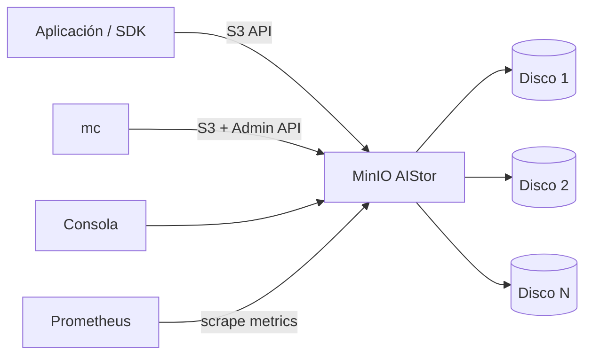
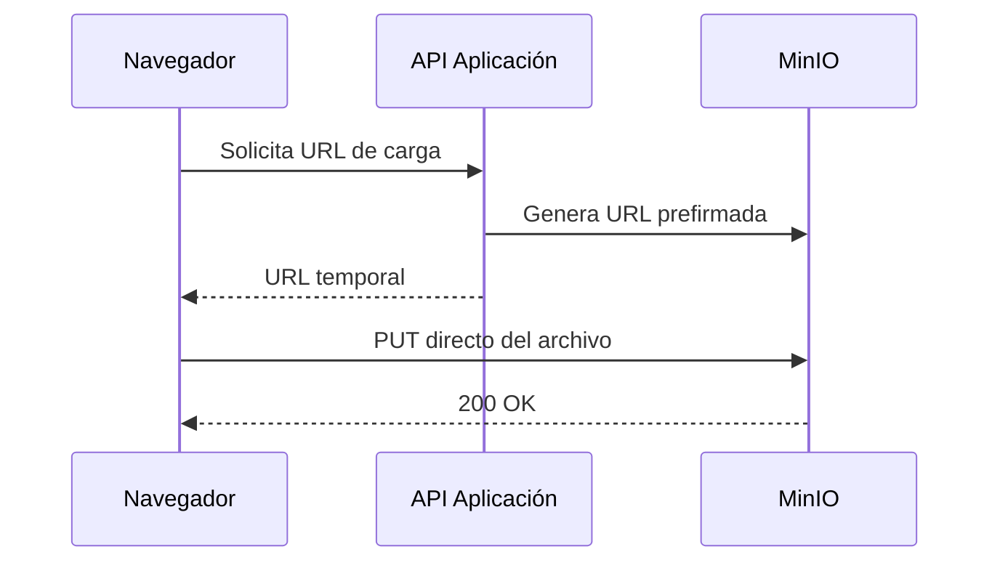
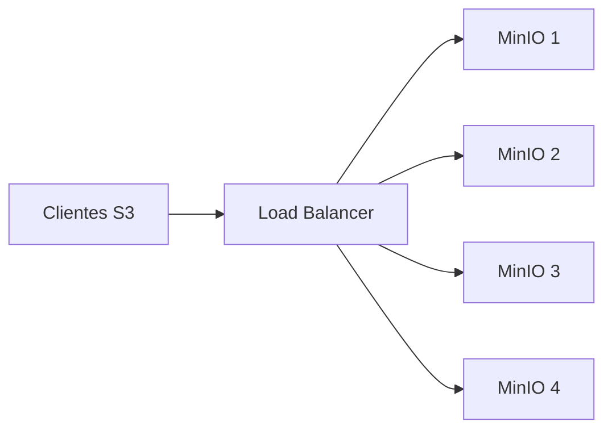
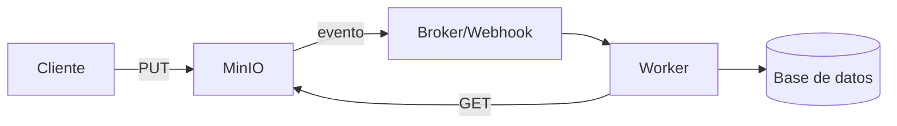
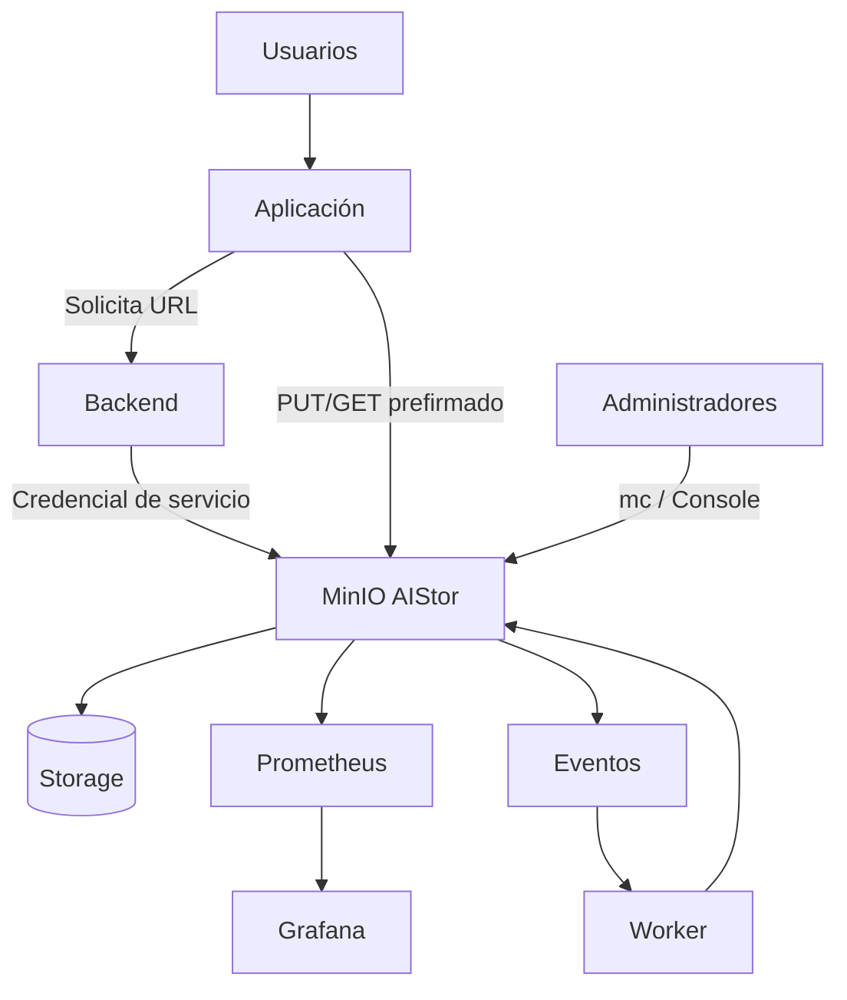

# Curso profesional de MinIO / MinIO AIStor

**Nivel:** Fundamentos e intermedio  
**Modalidad:** Teórico-práctica  
**Duración sugerida:** 32 a 40 horas  
**Versión del material:** 1.0 — agosto de 2026  
**Enfoque:** almacenamiento de objetos compatible con S3, administración, seguridad, integración y operación.

---

## 1. Presentación del curso

MinIO es una tecnología de almacenamiento de objetos orientada a cargas que utilizan la API de Amazon S3. Durante años, el proyecto abierto `minio/minio` fue una de las implementaciones S3 compatibles más conocidas para infraestructura propia. En 2026 el repositorio histórico de MinIO Community quedó archivado y sin mantenimiento activo. La línea vigente del producto es **MinIO AIStor**, que dispone de una edición **AIStor Free** para despliegues de un solo nodo y ediciones comerciales para topologías distribuidas, alta disponibilidad y características empresariales.

Este curso utiliza el término **MinIO** de forma general cuando se explican conceptos, herramientas y compatibilidad histórica; cuando una característica depende del producto actual se emplea explícitamente **MinIO AIStor**.

> **Nota de vigencia.** Las prácticas principales se han diseñado para AIStor Free y el cliente `mc`. Las secciones de clúster distribuido, replicación entre sitios, tiering y algunas herramientas avanzadas se estudian a nivel conceptual o como práctica opcional con una licencia Enterprise/Trial. Verifique siempre la documentación oficial antes de desplegar en producción.

### 1.1 Propósito

Al finalizar, el participante podrá desplegar y administrar una instancia MinIO AIStor, comprender el modelo de almacenamiento de objetos y la API S3, operar buckets y objetos, definir controles de acceso, aplicar versionado y políticas de retención, integrar aplicaciones mediante SDK, habilitar controles de seguridad, observar el servicio y diseñar una arquitectura adecuada para escenarios de producción.

### 1.2 Perfil de ingreso

Se recomienda que el participante tenga:

- conocimientos básicos de Linux, Windows o macOS;
- manejo elemental de terminal;
- nociones de redes TCP/IP, HTTP y DNS;
- experiencia básica con Docker o Podman, deseable pero no indispensable;
- conocimientos básicos de JSON;
- conocimientos básicos de Python para las prácticas de integración.

### 1.3 Competencias de salida

El participante será capaz de:

1. Explicar las diferencias entre almacenamiento de archivos, bloques y objetos.
2. Describir buckets, objetos, claves, metadatos y operaciones S3.
3. Desplegar AIStor Free en un entorno de laboratorio.
4. Administrar MinIO mediante la consola y `mc`.
5. Crear políticas de acceso basadas en IAM/PBAC.
6. Usar versionado, lifecycle, Object Lock y URLs prefirmadas.
7. Integrar una aplicación mediante Boto3 o el SDK de MinIO.
8. Implementar TLS y aplicar principios de mínimo privilegio.
9. Interpretar métricas, registros y síntomas de fallas.
10. Diseñar una topología de producción y un esquema de continuidad operativa.

---

# 2. Estructura general

| Módulo | Tema | Nivel | Horas sugeridas |
|---|---|---:|---:|
| 0 | Ecosistema MinIO en 2026 y preparación | Fundamentos | 1.5 |
| 1 | Almacenamiento de objetos y fundamentos S3 | Fundamentos | 2.5 |
| 2 | Arquitectura de MinIO y protección de datos | Fundamentos | 2.5 |
| 3 | Instalación y laboratorio con AIStor Free | Fundamentos | 3 |
| 4 | Administración con `mc` | Fundamentos | 3 |
| 5 | Identidad, usuarios, políticas y mínimo privilegio | Intermedio | 3.5 |
| 6 | Versionado, borrado, Object Lock y lifecycle | Intermedio | 3 |
| 7 | S3 desde aplicaciones: SDK y URLs prefirmadas | Intermedio | 4 |
| 8 | Seguridad de transporte y datos | Intermedio | 3 |
| 9 | Observabilidad, métricas y registros | Intermedio | 2.5 |
| 10 | Rendimiento y diseño de cargas | Intermedio | 2.5 |
| 11 | Alta disponibilidad, erasure coding y escalamiento | Intermedio | 2.5 |
| 12 | Replicación, continuidad y recuperación | Intermedio | 2.5 |
| 13 | Integración con proxy, aplicaciones y automatización | Intermedio | 2.5 |
| 14 | Troubleshooting y operación segura | Intermedio | 2.5 |
| 15 | Proyecto integrador y evaluación | Integrador | 3–5 |

---

# Módulo 0. Ecosistema MinIO en 2026 y preparación

## Objetivos

- Distinguir MinIO Community histórico de MinIO AIStor actual.
- Comprender qué puede practicarse con AIStor Free.
- Preparar el entorno de laboratorio.

## 0.1 Estado actual del ecosistema

A partir de 2026 conviene separar tres conceptos:

### A. MinIO Community histórico

El repositorio `github.com/minio/minio` fue publicado bajo AGPLv3 y durante años distribuyó servidor y contenedores de la edición comunitaria. El repositorio fue archivado el 25 de abril de 2026 y ya no se mantiene. Las versiones históricas siguen siendo relevantes para estudiar instalaciones existentes, migraciones y compatibilidad.

### B. MinIO AIStor

Es la línea actual del producto de MinIO. Expone una interfaz compatible con un subconjunto amplio de la API de Amazon S3 y añade capacidades relacionadas con operación empresarial, datos para IA y analítica.

### C. AIStor Free

AIStor Free permite un despliegue **standalone de un solo nodo**, con uno o varios discos. Está orientado a desarrollo, investigación, educación, homelabs y cargas donde no se requiera alta disponibilidad distribuida.

Según la documentación vigente, algunas capacidades quedan fuera de AIStor Free, entre ellas las topologías multi-nodo, replicación, tiering/transiciones de objetos y determinadas herramientas de diagnóstico y rendimiento. Por ello el curso marca esas prácticas como **conceptuales u opcionales**.

## 0.2 Software del laboratorio

Recomendado:

- Docker Desktop, Docker Engine o Podman.
- `mc` — MinIO AIStor Client.
- `curl`.
- Python 3.11+.
- `pip` o un administrador de entornos como `venv`.
- Editor de texto o IDE.
- Opcional: Prometheus y Grafana.

## 0.3 Puertos habituales

| Puerto | Uso |
|---:|---|
| 9000 | API S3 |
| 9001 | Consola web, según configuración |

No confunda la consola administrativa con el endpoint S3. Las aplicaciones deben apuntar al endpoint de la API S3.

## Actividad diagnóstica

Explique brevemente:

1. ¿Qué problema resolvería con almacenamiento de objetos en lugar de un NAS?
2. ¿Qué entiende por “S3 compatible”?
3. ¿Qué diferencia espera entre una credencial de administrador y una credencial de aplicación?

---

# Módulo 1. Almacenamiento de objetos y fundamentos S3

## Objetivos

- Comprender el modelo de almacenamiento de objetos.
- Identificar recursos y operaciones fundamentales de S3.
- Diferenciar la semántica de objetos de la de un filesystem.

## 1.1 Bloques, archivos y objetos

### Almacenamiento en bloque

Presenta volúmenes o dispositivos de bloques al sistema operativo. El filesystem se construye sobre esos bloques. Es apropiado para bases de datos, máquinas virtuales y sistemas que requieren semántica de disco.

### Almacenamiento de archivos

Expone archivos y directorios mediante protocolos como SMB o NFS. Mantiene una jerarquía de directorios y operaciones típicas de filesystem.

### Almacenamiento de objetos

Almacena cada unidad como un **objeto** compuesto por:

- datos;
- una clave o nombre;
- metadatos;
- atributos y etiquetas opcionales.

Los objetos se organizan dentro de **buckets** y se acceden normalmente por HTTP mediante una API.

## 1.2 Modelo mental S3

```text
Servicio S3
└── bucket: investigacion
    ├── datos/encuesta-2026.csv
    ├── documentos/protocolo.pdf
    └── imagenes/mapa.png
```

En un object store, `datos/encuesta-2026.csv` es una **clave completa**. La apariencia de carpetas normalmente se deriva de prefijos; no implica necesariamente un directorio físico tradicional.

## 1.3 Conceptos fundamentales

### Bucket

Contenedor lógico de objetos. Muchos controles se aplican a nivel de bucket: versionado, políticas, lifecycle, replicación o retención.

### Object key

Identificador del objeto dentro de un bucket.

### Metadata

Información asociada al objeto, como tipo MIME, tamaño, checksum, etiquetas o metadatos definidos por la aplicación.

### ETag

Identificador asociado a la representación almacenada. No debe asumirse universalmente que siempre equivale al MD5, especialmente en cargas multipart o implementaciones concretas.

### Prefix

Parte inicial de una clave usada para agrupar o filtrar objetos.

## 1.4 Operaciones S3 esenciales

| Operación | Finalidad |
|---|---|
| `PutObject` | Subir/crear un objeto |
| `GetObject` | Descargar un objeto |
| `HeadObject` | Consultar metadatos sin descargar el contenido |
| `DeleteObject` | Solicitar eliminación |
| `ListObjectsV2` | Enumerar objetos |
| `CopyObject` | Copiar un objeto |
| Multipart Upload | Subir objetos grandes por partes |

## 1.5 Consistencia y diseño de aplicaciones

No diseñe una aplicación suponiendo que un object store es un filesystem POSIX. Evite patrones como:

- abrir un objeto y modificar bytes arbitrarios “en sitio”;
- depender de locks de archivo tradicionales;
- hacer millones de pequeñas actualizaciones sobre el mismo objeto;
- usar renombrado como operación central del flujo.

En almacenamiento de objetos suele ser más natural escribir una nueva versión o un nuevo objeto.

## 1.6 Casos de uso

- respaldos;
- data lakes;
- repositorios de evidencias científicas;
- imágenes, video y audio;
- artefactos de CI/CD;
- datasets de IA/ML;
- documentos institucionales;
- archivos estáticos de aplicaciones;
- intercambio controlado de archivos mediante URLs prefirmadas.

## Práctica 1. Diseñar un namespace de objetos

Proponga un bucket y esquema de claves para un proyecto de investigación regional.

Ejemplo:

```text
bucket: proyecto-desarrollo-regional
raw/2026/encuestas/encuesta-0001.json
raw/2026/encuestas/encuesta-0002.json
processed/2026/indicadores/municipios.parquet
reports/2026/informe-final.pdf
```

### Criterios

- nombres predecibles;
- prefijos útiles para filtrado;
- separación entre datos crudos y procesados;
- evitar información sensible innecesaria en las claves.

## Autoevaluación

1. ¿Por qué una “carpeta” en S3 suele ser un prefijo?
2. ¿Qué ventaja tiene `HeadObject` frente a `GetObject` cuando solo se requieren metadatos?
3. ¿Por qué no conviene tratar un object store como un disco POSIX?

---

# Módulo 2. Arquitectura de MinIO y protección de datos

## Objetivos

- Comprender los componentes principales.
- Explicar erasure coding, parity, quorum y healing.
- Identificar dominios de falla.

## 2.1 Arquitectura lógica



En un entorno distribuido empresarial se agregan múltiples nodos, pools y dominios de falla.

## 2.2 Erasure coding

MinIO utiliza **Reed–Solomon erasure coding** para dividir objetos en fragmentos de datos y paridad. La finalidad es poder reconstruir información si algunos fragmentos o discos dejan de estar disponibles.

Conceptualmente:

```text
Objeto
  ↓
[data][data][data][data][parity][parity]
  ↓      ↓      ↓      ↓       ↓       ↓
 D1     D2     D3     D4      D5      D6
```

Los parámetros concretos dependen del tamaño del erasure set y la paridad configurada.

## 2.3 Quorum

Un sistema distribuido necesita suficientes componentes disponibles para aceptar lecturas o escrituras de forma segura. En MinIO, la pérdida de demasiados shards o drives puede romper el **read quorum** o **write quorum**.

No interprete “puedo perder N discos” sin considerar:

- en qué erasure set se encuentran;
- qué objetos están afectados;
- la paridad con la que fueron escritos;
- si la pérdida ocurre de forma simultánea.

## 2.4 Healing

Healing es el proceso de reconstrucción de datos dañados o faltantes a partir de shards sanos y paridad. Puede intervenir ante:

- falla de disco;
- corrupción;
- bit rot;
- reincorporación de componentes.

La capacidad de reconstrucción depende de que permanezcan suficientes shards íntegros.

## 2.5 Bit rot

La corrupción silenciosa de datos puede ocurrir por fallas de hardware o almacenamiento. Los mecanismos de integridad y scanning permiten detectar inconsistencias y, si existe redundancia suficiente, reconstruir el contenido.

## Práctica 2. Razonamiento de disponibilidad

Suponga un esquema conceptual con 8 shards: 6 de datos y 2 de paridad.

1. ¿Cuántos shards íntegros se requieren conceptualmente para reconstruir el objeto?
2. ¿Qué ocurre si quedan solo 5?
3. ¿Por qué la distribución de fallas importa tanto como el número total?

> Esta práctica es conceptual. Los detalles reales de quorum y erasure set deben consultarse en la documentación de la versión desplegada.

---

# Módulo 3. Instalación y laboratorio con AIStor Free

## Objetivos

- Obtener una licencia Free para laboratorio.
- Ejecutar AIStor como contenedor.
- Conectar la consola y `mc`.
- Validar persistencia de datos.

## 3.1 Obtener AIStor Free

La edición Free requiere un archivo de licencia. El proceso vigente se inicia desde la página de precios de MinIO y permite usar AIStor en un solo recurso de cómputo con uno o varios drives.

Guarde el archivo como:

```text
~/minio/minio.license
```

En Windows puede usar, por ejemplo:

```text
C:\minio\minio.license
```

## 3.2 Preparar directorios

Linux/macOS:

```bash
mkdir -p "$HOME/minio/data" "$HOME/minio/certs"
```

## 3.3 Ejecución con Docker

Ejemplo alineado con la documentación actual:

```bash
docker run -dt \
  -p 9000:9000 -p 9001:9001 \
  -v "$HOME/minio/data:/mnt/data" \
  -v "$HOME/minio/minio.license:/minio.license:ro" \
  -v "$HOME/minio/certs:/etc/minio/certs" \
  -e MINIO_ROOT_USER='labadmin' \
  -e MINIO_ROOT_PASSWORD='Cambiar-Esta-Clave-Larga-2026!' \
  --name aistor-server \
  quay.io/minio/aistor/minio:latest \
  minio server /mnt/data --console-address ':9001' --license /minio.license
```

Consultar logs:

```bash
docker logs aistor-server
```

Estado:

```bash
docker ps
```

## 3.4 Docker Compose para laboratorio

Cree `compose.yaml`:

```yaml
services:
  minio:
    image: quay.io/minio/aistor/minio:latest
    container_name: aistor-server
    command: >
      minio server /mnt/data
      --console-address :9001
      --license /minio.license
    ports:
      - "9000:9000"
      - "9001:9001"
    environment:
      MINIO_ROOT_USER: ${MINIO_ROOT_USER}
      MINIO_ROOT_PASSWORD: ${MINIO_ROOT_PASSWORD}
    volumes:
      - ./data:/mnt/data
      - ./minio.license:/minio.license:ro
      - ./certs:/etc/minio/certs
    restart: unless-stopped
```

Archivo `.env`:

```dotenv
MINIO_ROOT_USER=labadmin
MINIO_ROOT_PASSWORD=Cambiar-Esta-Clave-Larga-2026!
```

Arranque:

```bash
docker compose up -d
docker compose logs -f minio
```

> No suba `.env`, credenciales o archivos de licencia a repositorios públicos.

## 3.5 Acceso a consola

Abra:

```text
http://localhost:9001
```

La API S3 queda normalmente en:

```text
http://localhost:9000
```

## 3.6 Instalar `mc`

Linux AMD64:

```bash
curl --progress-bar -L \
  https://dl.min.io/aistor/mc/release/linux-amd64/mc \
  -o mc
chmod +x mc
sudo mv mc /usr/local/bin/
mc --version
```

En Windows, la documentación vigente ofrece `mc.exe` desde el repositorio de descargas de AIStor.

## 3.7 Crear un alias

```bash
mc alias set laboratorio \
  http://localhost:9000 \
  labadmin \
  'Cambiar-Esta-Clave-Larga-2026!'
```

Verificar:

```bash
mc alias list
mc ready laboratorio
```

## 3.8 Primera carga

```bash
printf 'Hola MinIO\n' > hola.txt
mc mb laboratorio/curso
mc cp hola.txt laboratorio/curso/
mc ls laboratorio/curso
mc cat laboratorio/curso/hola.txt
mc stat laboratorio/curso/hola.txt
```

## Práctica 3. Persistencia

1. Suba tres archivos.
2. Detenga el contenedor.
3. Inícielo de nuevo.
4. Compruebe que los objetos persisten.

```bash
docker stop aistor-server
docker start aistor-server
mc ls laboratorio/curso
```

### Resultado esperado

Los objetos permanecen porque el directorio de datos está montado fuera del filesystem efímero del contenedor.

---

# Módulo 4. Administración con `mc`

## Objetivos

- Dominar operaciones frecuentes.
- Comprender alias, rutas y comandos recursivos.
- Gestionar buckets y objetos sin depender de la consola.

## 4.1 Filosofía de `mc`

`mc` usa una sintaxis similar a utilidades Unix, pero opera sobre servicios S3 compatibles.

Formato general:

```text
mc <comando> <alias>/<bucket>/<objeto>
```

## 4.2 Comandos esenciales

### Crear bucket

```bash
mc mb laboratorio/datos
```

### Listar

```bash
mc ls laboratorio
mc ls laboratorio/datos
mc ls --recursive laboratorio/datos
```

### Subir

```bash
mc cp archivo.csv laboratorio/datos/
mc cp --recursive ./dataset laboratorio/datos/dataset/
```

### Descargar

```bash
mc cp laboratorio/datos/archivo.csv ./descargas/
```

### Inspeccionar

```bash
mc stat laboratorio/datos/archivo.csv
mc du laboratorio/datos
mc tree laboratorio/datos
```

### Eliminar

```bash
mc rm laboratorio/datos/archivo.csv
```

Sea especialmente cuidadoso con operaciones recursivas.

## 4.3 `mc mirror`

`mirror` sincroniza contenido entre un origen y un destino.

```bash
mc mirror ./dataset laboratorio/datos/dataset
```

Para reflejar borrados, revise explícitamente las opciones de la versión instalada antes de automatizar.

## 4.4 Pipe y streams

Crear un objeto desde stdin:

```bash
echo 'registro generado por pipeline' | mc pipe laboratorio/datos/pipeline.txt
```

Leer parte del contenido:

```bash
mc head laboratorio/datos/pipeline.txt
```

## 4.5 Alias múltiples

Puede configurar varios servicios:

```bash
mc alias set dev  http://dev.example.local:9000 ACCESS SECRET
mc alias set prod https://s3.example.org ACCESS SECRET
```

Esto facilita migraciones y comparaciones, pero exige una disciplina estricta para no ejecutar un borrado contra el entorno incorrecto.

## 4.6 Buenas prácticas operativas

- nombres de alias inequívocos;
- no usar credenciales root para scripts;
- probar comandos destructivos en DEV;
- revisar el destino antes de `rm --recursive`;
- automatizar con usuarios de servicio de permisos mínimos;
- mantener registro de cambios administrativos.

## Práctica 4. Dataset de trabajo

Cree:

```text
./dataset/
├── raw/
│   ├── a.csv
│   └── b.csv
└── processed/
    └── resumen.csv
```

Luego:

```bash
mc mb laboratorio/proyecto
mc cp --recursive dataset/ laboratorio/proyecto/
mc tree laboratorio/proyecto
mc du laboratorio/proyecto
```

### Reto

Copie únicamente el prefijo `processed/` a un segundo bucket llamado `publicaciones`.

---

# Módulo 5. Identidad, usuarios, políticas y mínimo privilegio

## Objetivos

- Comprender IAM/PBAC en MinIO.
- Crear usuarios y políticas.
- Aplicar mínimo privilegio.
- Diferenciar credenciales humanas y de aplicaciones.

## 5.1 Root no es una cuenta de uso cotidiano

La cuenta root tiene privilegios totales. Debe reservarse para bootstrap y operaciones estrictamente administrativas.

En producción:

- use credenciales largas y aleatorias;
- almacénelas en un gestor de secretos;
- cree administradores nominales o roles apropiados;
- use cuentas distintas por aplicación;
- considere deshabilitar acceso root a la API cuando la administración alternativa esté validada.

## 5.2 PBAC e IAM

MinIO AIStor implementa **Policy-Based Access Control (PBAC)** con documentos compatibles en estructura y comportamiento con políticas IAM de AWS.

Elementos típicos:

```json
{
  "Version": "2012-10-17",
  "Statement": [
    {
      "Effect": "Allow",
      "Action": ["s3:GetObject"],
      "Resource": ["arn:aws:s3:::publicaciones/*"]
    }
  ]
}
```

Principios:

- `Allow` concede lo especificado.
- `Deny` explícito prevalece cuando coincide con la solicitud.
- `Action` representa operaciones.
- `Resource` limita el recurso.
- `Condition` puede restringir contexto adicional.

## 5.3 Crear un usuario

```bash
mc admin user add laboratorio analista 'Secreto-Muy-Largo-2026!'
```

Listar:

```bash
mc admin user ls laboratorio
```

Inspeccionar:

```bash
mc admin user info laboratorio analista
```

## 5.4 Política de solo lectura de un bucket

Cree `solo-lectura-proyecto.json`:

```json
{
  "Version": "2012-10-17",
  "Statement": [
    {
      "Effect": "Allow",
      "Action": [
        "s3:ListBucket",
        "s3:GetBucketLocation"
      ],
      "Resource": [
        "arn:aws:s3:::proyecto"
      ]
    },
    {
      "Effect": "Allow",
      "Action": [
        "s3:GetObject"
      ],
      "Resource": [
        "arn:aws:s3:::proyecto/*"
      ]
    }
  ]
}
```

Crear política:

```bash
mc admin policy create laboratorio lectura-proyecto solo-lectura-proyecto.json
```

Adjuntar:

```bash
mc admin policy attach laboratorio lectura-proyecto --user analista
```

Verificar:

```bash
mc admin policy entities laboratorio lectura-proyecto
```

## 5.5 Validación efectiva

Configure otro alias con el usuario limitado:

```bash
mc alias set analista-local \
  http://localhost:9000 \
  analista \
  'Secreto-Muy-Largo-2026!'
```

Pruebe:

```bash
mc ls analista-local/proyecto
mc cp analista-local/proyecto/raw/a.csv ./
```

La escritura debería fallar si la política solo permite lectura:

```bash
echo 'no autorizado' > prueba.txt
mc cp prueba.txt analista-local/proyecto/
```

## 5.6 Service accounts y credenciales de aplicaciones

Evite reutilizar credenciales humanas en servicios. Un patrón profesional es que cada aplicación tenga su propia identidad y permisos mínimos.

Beneficios:

- revocación independiente;
- trazabilidad;
- rotación sin afectar a usuarios;
- reducción del blast radius.

## 5.7 Proveedores externos

En entornos empresariales, AIStor puede integrarse con proveedores de identidad como LDAP/Active Directory u OpenID Connect. El detalle se considera intermedio-avanzado porque depende de la infraestructura institucional.

## Práctica 5. Separación de funciones

Defina tres identidades:

| Identidad | Permiso |
|---|---|
| `ingesta-app` | escribir en `proyecto/raw/*` |
| `analista` | leer `proyecto/raw/*` y escribir `proyecto/processed/*` |
| `publicador` | leer `processed/*` y escribir `publicaciones/*` |

Diseñe las tres políticas JSON y pruebe que cada identidad **no** pueda realizar las acciones de las otras.

---

# Módulo 6. Versionado, borrado, Object Lock y lifecycle

## Objetivos

- Activar versionado.
- Comprender delete markers.
- Aplicar retención e inmutabilidad.
- Crear reglas de lifecycle.

## 6.1 Versionado

El versionado conserva múltiples iteraciones de una misma clave.

Activar:

```bash
mc version enable laboratorio/proyecto
```

Verificar:

```bash
mc version info laboratorio/proyecto
```

Suba varias versiones:

```bash
echo 'v1' > version.txt
mc cp version.txt laboratorio/proyecto/version.txt

echo 'v2' > version.txt
mc cp version.txt laboratorio/proyecto/version.txt

mc ls --versions laboratorio/proyecto/version.txt
```

## 6.2 Delete markers

En buckets versionados, una eliminación ordinaria puede crear un marcador de eliminación en lugar de destruir inmediatamente todo el historial. Esto permite recuperar versiones anteriores bajo ciertas condiciones.

No confunda:

- “el objeto ya no aparece como actual”;
- “todos sus bytes y versiones fueron eliminados definitivamente”.

## 6.3 Object Lock

Object Lock permite imponer inmutabilidad sobre versiones de objetos durante un periodo o mediante legal hold. Requiere versionado.

Casos de uso:

- evidencia regulatoria;
- respaldos resistentes a ransomware;
- conservación documental;
- datos que no deben alterarse durante un plazo.

Conceptos:

- **retention**: impide eliminar/modificar una versión durante un periodo;
- **legal hold**: mantiene la versión bloqueada hasta que el hold se retire de manera autorizada;
- **WORM**: Write Once, Read Many.

> La configuración exacta y las capacidades disponibles dependen de la versión/licencia. Practique primero en un bucket de laboratorio porque las políticas de inmutabilidad pueden impedir borrados deliberadamente.

## 6.4 Lifecycle Management

Lifecycle permite automatizar expiración de objetos.

Ejemplo: expirar objetos después de 90 días:

```bash
mc ilm rule add laboratorio/logs --expire-days 90
```

Listar reglas:

```bash
mc ilm rule ls laboratorio/logs
```

AIStor Free puede utilizar expiración, pero las **transiciones a tiers remotos** forman parte de funciones no incluidas en la edición Free vigente.

## 6.5 Diseño responsable de retención

Antes de activar reglas, documente:

- requisito legal;
- responsable de datos;
- RPO/RTO;
- periodo de recuperación;
- impacto en capacidad;
- tratamiento de versiones no actuales;
- mecanismo de aprobación de borrado.

## Práctica 6. Recuperación lógica

1. Active versionado.
2. Suba tres versiones de `informe.txt`.
3. Liste versiones.
4. Ejecute un borrado normal.
5. Observe el delete marker.
6. Recupere el ID de una versión anterior y descárguela.

> Si su licencia impide una operación específica de borrado por versión, documente la limitación y complete el análisis de forma conceptual.

---

# Módulo 7. S3 desde aplicaciones: SDK y URLs prefirmadas

## Objetivos

- Usar MinIO como backend S3 de aplicaciones.
- Trabajar con Boto3.
- Usar el SDK de MinIO para Python.
- Generar URLs prefirmadas.

## 7.1 Endpoint, credenciales y región

Una aplicación S3 normalmente necesita:

- endpoint;
- access key;
- secret key;
- bucket;
- región, cuando el cliente lo solicite;
- configuración TLS.

Ejemplo local:

```text
Endpoint: http://localhost:9000
Bucket: proyecto
```

## 7.2 Entorno Python

```bash
python -m venv .venv
```

Linux/macOS:

```bash
source .venv/bin/activate
```

Windows PowerShell:

```powershell
.\.venv\Scripts\Activate.ps1
```

Instale:

```bash
pip install boto3 minio
```

## 7.3 Boto3 con endpoint S3 compatible

```python
import boto3

s3 = boto3.client(
    "s3",
    endpoint_url="http://localhost:9000",
    aws_access_key_id="app-access-key",
    aws_secret_access_key="app-secret-key",
    region_name="us-east-1",
)

s3.upload_file(
    "datos.csv",
    "proyecto",
    "raw/2026/datos.csv",
)

respuesta = s3.list_objects_v2(
    Bucket="proyecto",
    Prefix="raw/2026/",
)

for obj in respuesta.get("Contents", []):
    print(obj["Key"], obj["Size"])
```

Nunca hardcodee secretos reales en código de producción. Use variables de entorno, gestores de secretos o mecanismos de identidad apropiados.

## 7.4 Variables de entorno

```bash
export S3_ENDPOINT='http://localhost:9000'
export S3_ACCESS_KEY='app-access-key'
export S3_SECRET_KEY='app-secret-key'
export S3_BUCKET='proyecto'
```

Python:

```python
import os
import boto3

s3 = boto3.client(
    "s3",
    endpoint_url=os.environ["S3_ENDPOINT"],
    aws_access_key_id=os.environ["S3_ACCESS_KEY"],
    aws_secret_access_key=os.environ["S3_SECRET_KEY"],
)
```

## 7.5 SDK de MinIO para Python

```python
from minio import Minio

client = Minio(
    "localhost:9000",
    access_key="app-access-key",
    secret_key="app-secret-key",
    secure=False,
)

client.fput_object(
    "proyecto",
    "raw/2026/datos.csv",
    "datos.csv",
)
```

## 7.6 ¿Boto3 o SDK de MinIO?

Use Boto3 cuando:

- la aplicación ya está diseñada para AWS S3;
- desea portabilidad entre proveedores S3;
- su equipo domina el ecosistema AWS.

Use SDK de MinIO cuando:

- desea una biblioteca enfocada en MinIO/S3;
- el lenguaje y las funciones requeridas encajan mejor con el SDK.

La decisión debe basarse en compatibilidad real de operaciones, mantenimiento y portabilidad, no solo en preferencia.

## 7.7 URLs prefirmadas

Permiten conceder acceso temporal sin entregar la secret key al cliente final.

Con `mc`:

```bash
mc share download --expire 30m \
  laboratorio/proyecto/reports/informe.pdf
```

Para carga temporal:

```bash
mc share upload --expire 15m \
  laboratorio/proyecto/inbox/nuevo.pdf
```

Patrón web típico:



Ventajas:

- la aplicación no retransmite archivos grandes;
- las credenciales S3 no llegan al navegador;
- el acceso expira;
- la política de la identidad que firma sigue siendo relevante.

## 7.8 Multipart upload

Los objetos grandes pueden transferirse por partes. Beneficios:

- reintentar solo partes fallidas;
- paralelismo;
- mejor manejo de conexiones inestables.

La biblioteca suele gestionar multipart de forma automática a partir de ciertos tamaños, pero la estrategia debe probarse con la carga real.

## Práctica 7. Mini API de documentos

Cree un script que:

1. reciba una ruta local;
2. suba el archivo a `proyecto/inbox/`;
3. agregue metadatos simples;
4. liste objetos;
5. genere una URL de descarga de 10 minutos.

### Requisitos de seguridad

- credenciales solo por variables de entorno;
- usuario limitado al bucket del ejercicio;
- validar que el objeto exista antes de generar la URL.

---

# Módulo 8. Seguridad de transporte y datos

## Objetivos

- Habilitar TLS.
- Aplicar hardening básico.
- Comprender cifrado del lado servidor y gestión de claves.

## 8.1 Modelo de amenazas

Proteja al menos:

1. credenciales;
2. tráfico de red;
3. datos almacenados;
4. permisos;
5. interfaces administrativas;
6. logs y auditoría;
7. backups;
8. supply chain de imágenes y dependencias.

## 8.2 TLS

AIStor soporta TLS 1.2 o posterior. En Linux, el servidor puede utilizar un directorio de certificados que contenga:

```text
public.crt
private.key
CAs/
```

Para laboratorio puede usar un certificado autofirmado; en producción use una PKI institucional o una CA confiable.

Cuando TLS esté habilitado, cambie:

```text
http://minio.example.org:9000
```

por:

```text
https://minio.example.org:9000
```

Evite `--insecure` fuera de pruebas controladas.

## 8.3 Secretos

No use:

- secretos en Git;
- claves dentro de imágenes Docker;
- contraseñas por defecto;
- una sola cuenta para todas las aplicaciones.

Prefiera:

- Docker/Kubernetes Secrets;
- Vault u otro secret manager;
- variables `_FILE` cuando sean apropiadas;
- rotación y revocación;
- credenciales temporales o de servicio.

## 8.4 Server-Side Encryption

AIStor puede integrarse con un Key Management Service para cifrado del lado servidor. A nivel conceptual, separe:

- cifrado TLS: protege datos **en tránsito**;
- SSE: protege datos **en reposo**;
- control de acceso: determina **quién** puede leer o escribir;
- Object Lock: controla **mutabilidad/retención**.

Ninguno sustituye completamente a los demás.

## 8.5 Hardening de producción

Checklist:

- [ ] credenciales root rotadas;
- [ ] root no usado por aplicaciones;
- [ ] TLS válido;
- [ ] mínimo privilegio;
- [ ] administración restringida por red;
- [ ] secretos fuera de repositorios;
- [ ] monitoreo y alertas;
- [ ] política de parches;
- [ ] pruebas de recuperación;
- [ ] capacidad y crecimiento monitoreados;
- [ ] NTP/sincronización de tiempo;
- [ ] DNS estable;
- [ ] logs protegidos;
- [ ] backups y/o réplica fuera del dominio de falla.

## Práctica 8. Revisión de seguridad

Revise el despliegue del módulo 3 y registre al menos diez diferencias entre un laboratorio y un entorno productivo.

---

# Módulo 9. Observabilidad, métricas y registros

## Objetivos

- Comprender las métricas expuestas por MinIO.
- Integrar Prometheus conceptualmente.
- Diagnosticar problemas con logs y señales operativas.

## 9.1 Tres pilares

Una operación saludable combina:

- métricas;
- logs;
- trazas/eventos cuando estén disponibles.

## 9.2 Métricas Prometheus

AIStor publica métricas utilizando el modelo de datos Prometheus. La documentación actual incluye endpoints versión 3 bajo:

```text
/minio/metrics/v3
```

Y categorías especializadas, por ejemplo:

```text
/minio/metrics/v3/audit
```

La autenticación y exposición de métricas deben configurarse de acuerdo con su entorno y versión.

## 9.3 Métricas útiles

Observe al menos:

- uso de capacidad;
- crecimiento por bucket;
- tasa de solicitudes;
- errores 4xx y 5xx;
- latencia;
- throughput;
- disponibilidad de drives/nodos;
- operaciones de healing;
- colas o backlogs de replicación, cuando aplique;
- estado de certificados/licencia;
- saturación de CPU, RAM, red y almacenamiento del host.

## 9.4 Prometheus conceptual

```yaml
scrape_configs:
  - job_name: minio
    metrics_path: /minio/metrics/v3
    static_configs:
      - targets:
          - minio.example.org:9000
```

Este fragmento es ilustrativo. Añada autenticación/TLS según la configuración real.

## 9.5 Logs

Ante un incidente, correlacione:

1. hora exacta;
2. operación S3;
3. código HTTP;
4. usuario o identidad;
5. bucket/objeto;
6. nodo/host;
7. cambios recientes;
8. estado de disco/red;
9. logs del proxy;
10. logs de la aplicación.

## 9.6 Alertas recomendadas

- capacidad > 70–80 % con tendencia ascendente;
- errores S3 por encima del baseline;
- latencia anormal;
- nodo o drive offline;
- certificado próximo a expirar;
- tasa sostenida de 5xx;
- cola de replicación creciente;
- procesos de healing prolongados;
- consumo de memoria o disco anormal.

## Práctica 9. Tablero mínimo

Diseñe un dashboard con seis paneles:

1. solicitudes por segundo;
2. errores;
3. latencia;
4. bytes almacenados;
5. capacidad disponible;
6. estado de infraestructura.

Para cada panel indique qué decisión operativa permite tomar.

---

# Módulo 10. Rendimiento y diseño de cargas

## Objetivos

- Comprender factores de rendimiento.
- Diseñar pruebas reproducibles.
- Evitar optimizaciones prematuras.

## 10.1 Qué determina el rendimiento

- tamaño de objetos;
- proporción lectura/escritura;
- concurrencia;
- red;
- latencia entre clientes y servidor;
- tipo y número de drives;
- CPU y memoria;
- erasure coding;
- TLS;
- metadata workload;
- patrón de prefijos;
- librería/SDK y configuración multipart;
- proxy o balanceador;
- límites del cliente.

## 10.2 Objetos pequeños vs grandes

Un millón de objetos de pocos KB puede comportarse muy distinto de cien objetos de varios GB. Por ello un benchmark debe reproducir:

- distribución de tamaños;
- concurrency real;
- GET/PUT ratio;
- duración suficiente;
- patrones de acceso.

## 10.3 Throughput y latencia

No son lo mismo.

- **throughput**: volumen transferido por unidad de tiempo;
- **latencia**: tiempo de respuesta de una operación.

Una arquitectura optimizada para transferencias masivas no necesariamente minimiza p99 de objetos pequeños.

## 10.4 Benchmark serio

Defina:

```text
Objetivo: 2 GiB/s agregados de lectura
Objetos: 64 MiB
Clientes: 8
Concurrencia: 16 por cliente
Duración: 20 min
TLS: habilitado
Dataset: 2x RAM total para evitar medir solo cache
Métricas: promedio, p95, p99, errores y saturación
```

La edición AIStor Free vigente no incluye determinadas herramientas internas de performance testing, por lo que puede usar herramientas externas S3 o sus propios scripts para un laboratorio.

## 10.5 Anti-patrones

- benchmark desde el mismo host y asumir que representa producción;
- probar solo 30 segundos;
- ignorar p95/p99;
- cambiar varias variables a la vez;
- llenar el storage al límite;
- comparar proveedores con configuraciones no equivalentes;
- medir solo Mbps sin errores ni latencia.

## Práctica 10. Benchmark con Python

Implemente un script que:

1. genere objetos de 1 MiB, 16 MiB y 128 MiB;
2. suba 20 objetos de cada tamaño;
3. mida tiempo total;
4. calcule throughput aproximado;
5. registre errores.

Repita con concurrencia 1, 4 y 8.

> El propósito no es obtener una cifra “universal”, sino aprender a construir un experimento controlado.

---

# Módulo 11. Alta disponibilidad, erasure coding y escalamiento

## Objetivos

- Comprender topologías distribuidas.
- Diseñar dominios de falla.
- Distinguir escalamiento de redundancia.

> **Licencia:** AIStor Free está limitada a un único nodo. Las prácticas multi-nodo requieren una edición/licencia que permita despliegues distribuidos.

## 11.1 Standalone vs distribuido

### Standalone

- simple;
- útil para desarrollo o casos sin requisito de HA;
- el host completo es un dominio de falla crítico.

### Distribuido

- múltiples nodos/drives;
- tolerancia a fallas según topología y quorum;
- escalamiento horizontal;
- mayor complejidad operativa.

## 11.2 Pools

Un pool representa un conjunto de recursos de almacenamiento que participa en la topología. La planificación debe hacerse antes de desplegar porque parámetros como la conformación de erasure sets tienen implicaciones duraderas.

## 11.3 Dominios de falla

Diseñe considerando:

- drive;
- controlador;
- servidor;
- rack;
- switch;
- PDU;
- zona de disponibilidad;
- sitio físico.

No tiene sentido distribuir servicios entre cuatro nodos si todos dependen del mismo único punto eléctrico sin protección cuando su objetivo es continuidad ante ese tipo de falla.

## 11.4 Balanceador

En topologías multi-nodo, los clientes suelen usar un endpoint estable delante del clúster.



El balanceador no reemplaza el diseño de almacenamiento ni el quorum.

## 11.5 Kubernetes

AIStor dispone de Operator y recursos declarativos para Kubernetes. Úselo cuando su organización ya tenga madurez operativa en Kubernetes. No adopte Kubernetes solo “para hacer MinIO distribuido” sin evaluar la complejidad total.

## Práctica 11. Diseño

Diseñe una plataforma para:

- 200 TiB útiles;
- crecimiento anual del 40 %;
- RPO de 15 minutos;
- RTO de 2 horas;
- acceso desde dos centros de datos;
- objetos promedio de 32 MiB.

Entregue:

- diagrama;
- dominios de falla;
- endpoint;
- estrategia de capacity planning;
- estrategia de backup/replicación;
- supuestos pendientes de validar.

---

# Módulo 12. Replicación, continuidad y recuperación

## Objetivos

- Separar backup, versionado, replicación y HA.
- Diseñar RPO/RTO.
- Comprender recuperación ante fallas.

> **Licencia:** la replicación se encuentra fuera de AIStor Free en la matriz vigente. Se estudia como capacidad de ediciones superiores o entornos de prueba autorizados.

## 12.1 Cuatro mecanismos distintos

### Alta disponibilidad

Mantiene el servicio ante ciertas fallas dentro de una topología.

### Versionado

Protege contra sobrescrituras y facilita recuperación lógica de versiones.

### Object Lock

Protege contra modificación/eliminación durante una retención.

### Replicación/backup

Crea copias adicionales en otro dominio lógico o físico.

Ninguno sustituye automáticamente a todos los demás.

## 12.2 RPO y RTO

- **RPO (Recovery Point Objective):** cuánto dato puede perderse, expresado en tiempo.
- **RTO (Recovery Time Objective):** cuánto puede tardar en volver el servicio.

Ejemplo:

```text
RPO = 15 min
RTO = 2 h
```

Esto obliga a diseñar tecnología, procesos, runbooks y pruebas compatibles con esos objetivos.

## 12.3 Replicación de buckets y sitios

MinIO dispone de mecanismos de replicación para escenarios empresariales. Antes de configurarlos, defina:

- direccionalidad;
- filtros;
- versionado;
- comportamiento de deletes;
- conflictos;
- ancho de banda;
- recuperación después de una interrupción;
- monitoreo del backlog.

## 12.4 Backup real

Un backup útil debe:

- estar separado del fallo principal;
- ser recuperable;
- estar probado;
- tener retención definida;
- protegerse con credenciales independientes;
- idealmente incluir inmutabilidad.

“Tenemos otra copia” no es suficiente si nunca se ha ejecutado una restauración.

## 12.5 Runbook de recuperación

Incluya:

1. criterio para declarar incidente;
2. responsable;
3. pasos de contención;
4. comprobación de integridad;
5. recuperación del servicio;
6. validación de aplicaciones;
7. reconciliación de datos;
8. comunicación;
9. postmortem.

## Práctica 12. Tabletop exercise

Simule:

> Un usuario con credenciales comprometidas elimina objetos del bucket de producción a las 10:15. El monitoreo detecta el comportamiento a las 10:27.

Responda:

- ¿qué mecanismo evita daño permanente?
- ¿qué logs necesita?
- ¿cómo corta el acceso?
- ¿cómo recupera objetos?
- ¿cómo comprueba que no hay persistencia del atacante?
- ¿cómo previene recurrencia?

---

# Módulo 13. Integración con proxy, aplicaciones y automatización

## Objetivos

- Diseñar un endpoint estable.
- Comprender reverse proxy y balanceo.
- Automatizar administración de manera segura.

## 13.1 Reverse proxy

Un proxy puede proporcionar:

- FQDN estable;
- terminación TLS;
- balanceo;
- controles de red;
- observabilidad adicional.

Debe configurarse respetando solicitudes S3, tamaños grandes, timeouts y headers necesarios para firmas.

## 13.2 NGINX conceptual

```nginx
upstream minio_s3 {
    server minio:9000;
}

server {
    listen 443 ssl;
    server_name s3.example.org;

    client_max_body_size 0;

    location / {
        proxy_set_header Host $http_host;
        proxy_set_header X-Real-IP $remote_addr;
        proxy_set_header X-Forwarded-For $proxy_add_x_forwarded_for;
        proxy_set_header X-Forwarded-Proto $scheme;
        proxy_pass http://minio_s3;
    }
}
```

Este ejemplo es didáctico, no una configuración completa de producción. Ajuste buffering, timeouts, TLS, health checks y seguridad a la infraestructura real.

## 13.3 Automatización idempotente

Para inicializar un entorno:

```bash
#!/usr/bin/env bash
set -euo pipefail

mc alias set laboratorio "$S3_ENDPOINT" "$S3_ACCESS_KEY" "$S3_SECRET_KEY"
mc mb --ignore-existing laboratorio/proyecto
mc version enable laboratorio/proyecto
```

La automatización debe ser:

- idempotente;
- auditable;
- parametrizada;
- sin secretos hardcodeados;
- probada antes de producción.

## 13.4 Event-driven architecture

MinIO puede emitir notificaciones de eventos hacia distintos sistemas según la configuración soportada. Ejemplos de uso:

- procesar un CSV al subirlo;
- extraer metadata de imágenes;
- iniciar un pipeline de IA;
- registrar evidencia en una base de datos;
- disparar antivirus/DLP.

Patrón:



## Práctica 13. Diseño de ingesta

Diseñe una solución donde investigadores suban archivos sin credenciales S3 permanentes y un worker procese automáticamente cada objeto.

Debe incluir:

- API de autenticación;
- URL prefirmada;
- bucket de ingesta;
- notificación/evento;
- worker;
- bucket de resultados;
- política IAM de cada componente.

---

# Módulo 14. Troubleshooting y operación segura

## Objetivos

- Seguir un método de diagnóstico reproducible.
- Distinguir errores de red, permisos, cliente y almacenamiento.
- Resolver incidentes frecuentes.

## 14.1 Método de diagnóstico

Use este orden:

1. reproducir;
2. registrar timestamp;
3. aislar cliente/servidor/red;
4. identificar código HTTP y error S3;
5. revisar identidad/política;
6. revisar endpoint/DNS/TLS;
7. revisar capacidad y salud;
8. revisar logs;
9. probar con `mc` o `curl` de referencia;
10. comparar con un entorno sano.

## 14.2 Error: AccessDenied

Revise:

- usuario correcto;
- política adjunta;
- `Action` requerida;
- ARN del bucket y objetos;
- `Deny` explícito;
- credenciales antiguas;
- bucket/prefijo real.

## 14.3 Error de firma

Posibles causas:

- secret incorrecto;
- reloj desincronizado;
- proxy alterando host/headers;
- endpoint incorrecto;
- región/configuración de cliente;
- URL prefirmada expirada.

## 14.4 TLS

Síntomas:

- certificado no confiable;
- hostname no coincide;
- CA no instalada;
- certificado expirado;
- cadena incompleta.

No convierta `--insecure` en la solución permanente. Corrija la confianza o el certificado.

## 14.5 Timeout

Investigue:

- DNS;
- firewall;
- MTU;
- proxy;
- ancho de banda;
- saturación de disco;
- objetos muy grandes;
- timeouts del cliente;
- caída parcial del backend.

## 14.6 Disco lleno

Evite operar persistentemente cerca del 100 %. El capacity planning debe anticipar:

- crecimiento;
- versiones;
- parity/overhead;
- multipart incompletos;
- lifecycle;
- logs;
- espacio del sistema operativo.

## 14.7 Runbook mínimo

```text
Incidente:
Inicio:
Impacto:
Servicios afectados:
Último cambio:
Síntoma:
Código HTTP / error S3:
Identidad:
Bucket/prefix:
Capacidad:
Estado de host/discos:
Hallazgos:
Acción de contención:
Recuperación:
Validación:
Prevención:
```

## Práctica 14. Casos de diagnóstico

Resuelva cinco escenarios:

1. `mc ls` funciona con root, pero una app recibe 403.
2. La consola abre, pero Boto3 no puede conectar.
3. Una URL prefirmada funciona internamente pero no detrás del proxy.
4. Los PUT grandes fallan después de 60 s.
5. El bucket parece vacío después de borrar objetos versionados, pero el uso de espacio no baja.

Para cada caso entregue hipótesis, evidencia a recolectar y pruebas de confirmación.

---

# Módulo 15. Proyecto integrador

## Objetivo

Construir una solución de almacenamiento de objetos segura y operable para un caso realista.

## Caso

Una institución requiere un repositorio para proyectos de investigación. Los investigadores cargarán datasets, el equipo de análisis procesará información y el área de difusión publicará resultados aprobados.

### Requisitos

- bucket de ingesta;
- bucket de datos procesados;
- bucket de publicaciones;
- identidades separadas;
- mínimo privilegio;
- versionado en datos críticos;
- política de lifecycle;
- URL prefirmada para cargas externas;
- TLS en diseño de producción;
- script Python para cargar/listar/descargar;
- dashboard conceptual;
- runbook de recuperación;
- diagrama de arquitectura;
- RPO/RTO definidos.

## Entregables

```text
proyecto-final/
├── README.md
├── arquitectura.md
├── compose.yaml
├── .env.example
├── policies/
│   ├── ingesta.json
│   ├── analista.json
│   └── publicador.json
├── scripts/
│   ├── init.sh
│   └── cliente.py
├── observabilidad/
│   └── metricas.md
├── seguridad/
│   └── hardening.md
└── runbooks/
    └── recuperacion.md
```

## Rúbrica

| Criterio | Peso |
|---|---:|
| Arquitectura y modelo S3 | 15 % |
| IAM y mínimo privilegio | 20 % |
| Gestión de datos y versionado | 15 % |
| Integración por SDK | 15 % |
| Seguridad | 15 % |
| Observabilidad y operación | 10 % |
| Documentación y reproducibilidad | 10 % |

### Nivel excelente

- no usa root en aplicaciones;
- políticas acotadas por acción y recurso;
- secretos externalizados;
- scripts reproducibles;
- diseño distingue claramente laboratorio y producción;
- RPO/RTO justifican las medidas de continuidad;
- incluye validación negativa de permisos.

---

# Evaluación final

## Parte A. Preguntas teóricas

1. ¿Qué diferencia existe entre una clave S3 y una ruta de filesystem?
2. ¿Qué función cumple un bucket?
3. ¿Qué riesgos introduce usar root desde una aplicación?
4. ¿Qué significa mínimo privilegio?
5. ¿Por qué un `Deny` explícito es importante en evaluación de políticas?
6. ¿Qué problema resuelve el versionado?
7. ¿Qué diferencia existe entre versionado y Object Lock?
8. ¿Qué diferencia existe entre TLS y server-side encryption?
9. ¿Qué es una URL prefirmada?
10. ¿Qué objetivo tiene multipart upload?
11. ¿Qué es erasure coding?
12. ¿Qué es healing?
13. ¿Por qué un benchmark debe reproducir tamaños y concurrencia reales?
14. ¿Qué diferencia existe entre RPO y RTO?
15. ¿Por qué replicación no es equivalente a backup?
16. ¿Qué señales observaría ante un aumento de errores 5xx?
17. ¿Por qué un proxy mal configurado puede romper firmas S3?
18. ¿Qué implica que AIStor Free sea standalone?
19. ¿Qué elementos deben formar parte de un runbook de recuperación?
20. ¿Qué comprobaría antes de culpar al servidor por un `AccessDenied`?

## Parte B. Ejercicio práctico

Cree un bucket `examen` y:

1. active versionado;
2. cree un usuario `lector-examen`;
3. permita únicamente listar el bucket y descargar objetos;
4. suba un archivo como administrador;
5. demuestre que el lector puede descargarlo;
6. demuestre que el lector no puede sobrescribirlo;
7. genere una URL prefirmada de 5 minutos;
8. documente los comandos utilizados.

---

# Respuestas orientativas de autoevaluación

## Módulo 1

1. Porque el object store trabaja con claves; los separadores suelen ser parte del nombre y permiten construir una vista jerárquica lógica.
2. `HeadObject` obtiene metadatos sin transferir el cuerpo completo.
3. Porque la semántica, operaciones y garantías no son equivalentes a POSIX.

## Módulo 2

En el ejemplo didáctico 6+2 se necesitan seis shards íntegros para reconstruir el contenido; con cinco ya no existirían suficientes partes. En una instalación real se debe consultar la configuración concreta del erasure set y paridad.

## Módulo 5

Una política de solo lectura suele necesitar permisos tanto sobre el bucket (`ListBucket`) como sobre objetos (`GetObject`). Limitar solo uno de los dos recursos produce errores comunes.

## Módulo 6

Versionado conserva generaciones; Object Lock impone restricciones de mutabilidad sobre versiones durante una retención o legal hold. Son mecanismos relacionados, pero no equivalentes.

## Módulo 12

RPO define la pérdida temporal máxima tolerable de datos; RTO define cuánto tiempo puede tardar la restauración del servicio.

---

# Apéndice A. Cheat sheet de `mc`

```bash
# Alias
mc alias set laboratorio http://localhost:9000 ACCESS SECRET
mc alias list

# Estado
mc ready laboratorio
mc ping laboratorio

# Buckets
mc mb laboratorio/datos
mc ls laboratorio
mc rb laboratorio/datos

# Objetos
mc cp archivo.txt laboratorio/datos/
mc cp laboratorio/datos/archivo.txt ./
mc ls laboratorio/datos
mc stat laboratorio/datos/archivo.txt
mc cat laboratorio/datos/archivo.txt
mc rm laboratorio/datos/archivo.txt

# Recursivo
mc cp --recursive ./dataset laboratorio/datos/
mc ls --recursive laboratorio/datos
mc mirror ./dataset laboratorio/datos/dataset

# Versionado
mc version enable laboratorio/datos
mc version info laboratorio/datos
mc ls --versions laboratorio/datos

# Lifecycle
mc ilm rule add laboratorio/logs --expire-days 90
mc ilm rule ls laboratorio/logs

# Compartir temporalmente
mc share download --expire 30m laboratorio/datos/informe.pdf
mc share upload --expire 15m laboratorio/datos/entrada.pdf

# Usuarios
mc admin user add laboratorio usuario 'Secret-Largo'
mc admin user ls laboratorio
mc admin user info laboratorio usuario

# Políticas
mc admin policy create laboratorio mi-politica policy.json
mc admin policy attach laboratorio mi-politica --user usuario
mc admin policy entities laboratorio mi-politica
```

> Antes de ejecutar comandos destructivos, consulte `mc <comando> --help` en la versión instalada.

---

# Apéndice B. Política IAM de ejemplo por prefijo

Permite listar únicamente el prefijo `processed/` y descargar sus objetos.

```json
{
  "Version": "2012-10-17",
  "Statement": [
    {
      "Effect": "Allow",
      "Action": ["s3:ListBucket"],
      "Resource": ["arn:aws:s3:::proyecto"],
      "Condition": {
        "StringLike": {
          "s3:prefix": ["processed/*"]
        }
      }
    },
    {
      "Effect": "Allow",
      "Action": ["s3:GetObject"],
      "Resource": ["arn:aws:s3:::proyecto/processed/*"]
    }
  ]
}
```

Pruebe siempre las políticas con casos positivos y negativos.

---

# Apéndice C. Cliente Python completo de ejemplo

```python
import os
from pathlib import Path
import boto3
from botocore.client import Config

ENDPOINT = os.environ["S3_ENDPOINT"]
ACCESS_KEY = os.environ["S3_ACCESS_KEY"]
SECRET_KEY = os.environ["S3_SECRET_KEY"]
BUCKET = os.environ.get("S3_BUCKET", "proyecto")

s3 = boto3.client(
    "s3",
    endpoint_url=ENDPOINT,
    aws_access_key_id=ACCESS_KEY,
    aws_secret_access_key=SECRET_KEY,
    region_name="us-east-1",
    config=Config(signature_version="s3v4"),
)


def upload(path: str, key: str) -> None:
    path_obj = Path(path)
    if not path_obj.is_file():
        raise FileNotFoundError(path)
    s3.upload_file(str(path_obj), BUCKET, key)
    print(f"Subido: s3://{BUCKET}/{key}")


def list_prefix(prefix: str = "") -> None:
    paginator = s3.get_paginator("list_objects_v2")
    for page in paginator.paginate(Bucket=BUCKET, Prefix=prefix):
        for obj in page.get("Contents", []):
            print(obj["Key"], obj["Size"])


def presigned_download(key: str, seconds: int = 600) -> str:
    return s3.generate_presigned_url(
        "get_object",
        Params={"Bucket": BUCKET, "Key": key},
        ExpiresIn=seconds,
    )


if __name__ == "__main__":
    list_prefix()
```

Variables:

```bash
export S3_ENDPOINT='http://localhost:9000'
export S3_ACCESS_KEY='app-access-key'
export S3_SECRET_KEY='app-secret-key'
export S3_BUCKET='proyecto'
python cliente.py
```

---

# Apéndice D. Arquitectura de referencia



Controles recomendados:

- TLS extremo a extremo o arquitectura TLS explícitamente justificada;
- RBAC/PBAC de mínimo privilegio;
- secretos en secret manager;
- auditoría;
- monitoreo;
- versionado y retención según clasificación de datos;
- estrategia de continuidad fuera del dominio de falla principal.

---

# Apéndice E. Checklist de paso a producción

## Plataforma

- [ ] capacidad inicial y crecimiento calculados;
- [ ] discos y filesystem validados;
- [ ] red dimensionada;
- [ ] DNS estable;
- [ ] NTP configurado;
- [ ] endpoints definidos;
- [ ] topología compatible con RPO/RTO;
- [ ] límites de licencia verificados.

## Seguridad

- [ ] TLS válido;
- [ ] credenciales root rotadas y protegidas;
- [ ] usuarios de aplicación separados;
- [ ] mínimo privilegio;
- [ ] secretos fuera de código;
- [ ] políticas revisadas;
- [ ] procedimiento de rotación;
- [ ] administración restringida;
- [ ] actualizaciones y CVE monitorizados.

## Datos

- [ ] versionado definido;
- [ ] lifecycle definido;
- [ ] retención aprobada;
- [ ] clasificación de información;
- [ ] backup/replicación probado;
- [ ] restore probado;
- [ ] capacidad para versiones y overhead considerada.

## Operación

- [ ] métricas;
- [ ] alertas;
- [ ] logs centralizados;
- [ ] runbooks;
- [ ] responsables de guardia;
- [ ] prueba de fallos;
- [ ] prueba de recuperación;
- [ ] documentación de cambios.

---

# Apéndice F. Glosario

**Access Key**  
Identificador de una credencial S3.

**Bucket**  
Contenedor lógico de objetos.

**Delete Marker**  
Marcador creado por ciertas eliminaciones en un bucket versionado para indicar que el objeto no debe aparecer como versión actual.

**Erasure Coding**  
Técnica de protección que divide datos y paridad en shards para permitir reconstrucción ante ciertas pérdidas.

**ETag**  
Identificador asociado a un objeto/respuesta S3; no debe asumirse siempre como MD5.

**Healing**  
Proceso de detección y reconstrucción de datos faltantes o dañados cuando existe redundancia suficiente.

**IAM/PBAC**  
Mecanismos de identidad y políticas que controlan acciones sobre recursos.

**Legal Hold**  
Mecanismo que mantiene una versión de objeto bajo retención hasta que una entidad autorizada retire el hold.

**Lifecycle**  
Reglas automáticas para expirar o, cuando la licencia y configuración lo permiten, transicionar objetos.

**Multipart Upload**  
Carga de un objeto dividido en partes.

**Object Lock**  
Mecanismo de inmutabilidad/retención de versiones.

**Object Key**  
Nombre completo del objeto dentro del bucket.

**Prefix**  
Cadena inicial de una key usada para agrupación lógica y filtrado.

**Presigned URL**  
URL firmada con permisos y expiración limitada que permite una operación S3 sin exponer la secret key.

**Quorum**  
Cantidad mínima de componentes/shards requeridos para determinadas operaciones coherentes.

**RPO**  
Máxima pérdida de datos tolerable medida temporalmente.

**RTO**  
Tiempo máximo objetivo para restaurar el servicio.

**S3**  
API y modelo de almacenamiento de objetos popularizados por Amazon Simple Storage Service.

**Secret Key**  
Secreto criptográfico asociado a una access key.

**Versioning**  
Conservación de múltiples versiones de una misma key.

**WORM**  
Write Once, Read Many: patrón de inmutabilidad durante un periodo de retención.

---

# Apéndice G. Referencias oficiales y lecturas recomendadas

Material verificado para esta edición del curso en agosto de 2026.

1. MinIO AIStor Documentation  
   https://docs.min.io/aistor/

2. MinIO AIStor — S3 API Compatibility  
   https://docs.min.io/aistor/developers/s3-api-compatibility/

3. MinIO AIStor — Container Installation  
   https://docs.min.io/aistor/installation/container/install/

4. MinIO AIStor — Licenses  
   https://docs.min.io/aistor/operations/licenses/

5. MinIO — AIStor Free Agreement  
   https://www.min.io/legal/aistor-free-agreement

6. MinIO AIStor — Identity and Access Management  
   https://docs.min.io/aistor/administration/iam/

7. MinIO AIStor — Object Versioning  
   https://docs.min.io/aistor/administration/objects-and-versioning/versioning/

8. MinIO AIStor — Object Locking and Immutability  
   https://docs.min.io/aistor/administration/object-locking-and-immutability/

9. MinIO AIStor — Object Lifecycle Management  
   https://docs.min.io/aistor/administration/object-lifecycle-management/

10. MinIO AIStor — Erasure Coding  
    https://docs.min.io/aistor/operations/core-concepts/erasure-coding/

11. MinIO AIStor — Healing  
    https://docs.min.io/aistor/operations/core-concepts/healing/

12. MinIO AIStor — Metrics  
    https://docs.min.io/aistor/operations/monitoring/metrics-and-alerts/

13. MinIO AIStor — Network Encryption  
    https://docs.min.io/aistor/installation/linux/network-encryption/

14. MinIO AIStor — Root Access Settings  
    https://docs.min.io/aistor/reference/aistor-server/settings/root-credentials/

15. MinIO Community historical repository (archived)  
    https://github.com/minio/minio

16. Amazon S3 API Reference / User Guide  
    https://docs.aws.amazon.com/s3/

17. Boto3 S3 documentation  
    https://boto3.amazonaws.com/v1/documentation/api/latest/reference/services/s3.html

---

# Recomendación de ruta de aprendizaje posterior

Después de completar este curso:

1. profundice en IAM avanzado y proveedores OIDC/LDAP;
2. practique con KMS y server-side encryption;
3. estudie Kubernetes Operator si su organización opera Kubernetes;
4. construya un entorno distribuido con licencia adecuada;
5. pruebe replicación y escenarios de desastre;
6. mida la carga real con objetos y concurrencia representativos;
7. automatice infraestructura y políticas mediante pipelines controlados;
8. incorpore threat modeling y revisiones de seguridad periódicas.

---

## Cierre

MinIO no debe aprenderse únicamente como “un servidor donde subo archivos”. Su valor aparece al comprender el modelo S3, separar identidades, diseñar políticas, controlar el ciclo de vida de los datos, proteger el transporte y los secretos, medir el comportamiento del sistema y planificar recuperación. El objetivo profesional es que el almacenamiento sea **predecible, seguro, observable y recuperable**.
