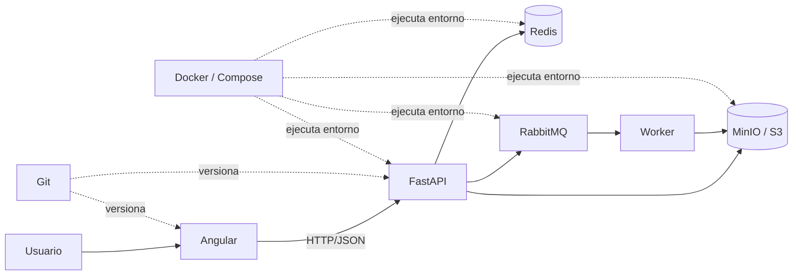
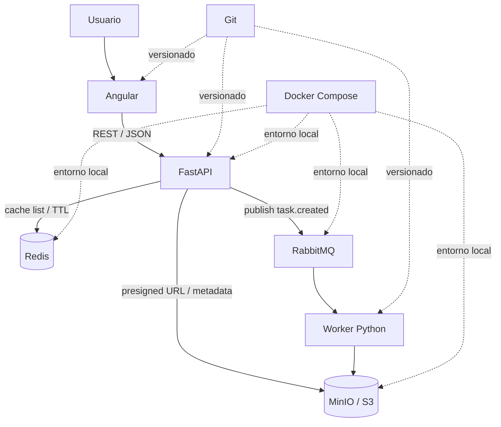

# Curso Express de Fundamentos para Desarrollo de Aplicaciones Web Modernas

## Git · Docker · FastAPI · Angular · Redis · RabbitMQ · MinIO

**Duración:** 4 días / 24 horas sugeridas  
**Modalidad:** teórico-práctica  
**Nivel:** fundamentos con visión de arquitectura  
**Enfoque:** comprender el papel de cada tecnología y construir una aplicación mínima integrada  
**Proyecto transversal:** **TaskFlow Express**, una aplicación sencilla de tareas con frontend, API, caché, mensajería y almacenamiento de objetos.

---

## 1. Propósito del curso

Este curso condensa los fundamentos más importantes de siete tecnologías que suelen aparecer juntas en arquitecturas modernas de software:

- **Git**, para control de versiones y colaboración.
- **Docker**, para entornos reproducibles y contenerización.
- **FastAPI**, para construir APIs HTTP con Python.
- **Angular**, para crear interfaces web de tipo SPA.
- **Redis**, para datos de baja latencia, caché y estructuras en memoria.
- **RabbitMQ**, para comunicación asíncrona mediante mensajes.
- **MinIO / S3**, para almacenamiento de objetos y archivos.

El objetivo no es dominar cada herramienta en cuatro días. El objetivo es que el participante pueda responder correctamente tres preguntas:

1. **¿Qué problema resuelve cada tecnología?**
2. **¿Cómo se utiliza en su forma mínima y correcta?**
3. **¿Cómo se relaciona con el resto de una aplicación moderna?**

---

## 2. Resultado de aprendizaje general

Al finalizar los cuatro días, el participante será capaz de:

1. Explicar una arquitectura web moderna de frontend, backend y servicios auxiliares.
2. Utilizar Git para registrar cambios, trabajar con ramas y resolver un flujo colaborativo básico.
3. Ejecutar servicios con Docker y Docker Compose.
4. Crear una API REST mínima con FastAPI y validación de datos.
5. Crear una interfaz Angular que consuma una API HTTP.
6. Reconocer cuándo Redis aporta valor y utilizar claves, TTL y caché básica.
7. Explicar el flujo productor → broker → consumidor en RabbitMQ.
8. Comprender buckets, objetos, claves y URLs prefirmadas en almacenamiento S3/MinIO.
9. Integrar conceptualmente los siete componentes en una arquitectura coherente.
10. Identificar qué aspectos requieren estudio posterior antes de un despliegue productivo.

---

## 3. Perfil de ingreso

Se recomienda que el participante tenga:

- fundamentos básicos de programación;
- manejo elemental de archivos y directorios;
- nociones de terminal o PowerShell;
- conceptos básicos de cliente-servidor;
- disposición para trabajar con Python, TypeScript y línea de comandos.

No se requiere experiencia previa con todas las tecnologías del curso.

---

## 4. Software sugerido

- Git
- Docker Desktop o Docker Engine con Docker Compose
- Python 3.11 o superior
- Node.js compatible con la versión de Angular utilizada
- Angular CLI
- Visual Studio Code o editor equivalente
- Navegador moderno
- `curl`, Bruno o Postman, opcional

Para el laboratorio integrado pueden utilizarse imágenes de contenedor para Redis, RabbitMQ y el almacenamiento S3 compatible seleccionado.

> **Nota:** las versiones concretas deben fijarse antes de impartir el curso y mantenerse constantes durante los cuatro días. En capacitación intensiva es preferible un laboratorio estable a perseguir la última versión disponible durante la sesión.

---

# 5. Arquitectura mental del curso



La idea central es separar responsabilidades:

| Tecnología | Pregunta que responde |
|---|---|
| Git | ¿Cómo registro, comparo y colaboro sobre cambios? |
| Docker | ¿Cómo ejecuto el mismo entorno de forma reproducible? |
| FastAPI | ¿Cómo expongo lógica y datos mediante HTTP? |
| Angular | ¿Cómo construyo la experiencia de usuario en el navegador? |
| Redis | ¿Cómo resuelvo datos temporales o de baja latencia? |
| RabbitMQ | ¿Cómo desacoplo procesos mediante mensajes? |
| MinIO / S3 | ¿Cómo almaceno objetos o archivos fuera del filesystem local de la aplicación? |

---

# 6. Estrategia didáctica

Cada bloque utiliza el mismo ciclo:

1. **Problema:** qué necesidad existe antes de introducir la herramienta.
2. **Modelo mental:** cómo pensar la tecnología.
3. **Mínimo funcional:** comandos o código esenciales.
4. **Práctica:** ejecutar un caso pequeño.
5. **Integración:** relacionarlo con TaskFlow Express.
6. **Criterio profesional:** saber cuándo usarlo y cuándo no.

Distribución sugerida de cada día:

- 30 % explicación y demostración;
- 55 % práctica guiada;
- 15 % recapitulación, diagnóstico y reto.

---

# DÍA 1 — Git, Docker y arquitectura cliente-servidor

**Duración sugerida:** 6 horas

## Objetivos del día

Al finalizar el día, el participante podrá:

- comprender el flujo básico de una aplicación web;
- utilizar Git para registrar cambios;
- trabajar con una rama y una integración básica;
- explicar imagen, contenedor, volumen, red y registro;
- ejecutar servicios con Docker;
- levantar un entorno multicontenedor con Docker Compose.

---

## 1. Fundamentos de arquitectura web

### 1.1 Cliente y servidor

Una aplicación web moderna suele separar:

```text
Navegador
   |
   | HTTP
   v
Frontend
   |
   | HTTP / JSON
   v
API Backend
   |
   +--> Base de datos
   +--> Caché
   +--> Broker de mensajes
   +--> Almacenamiento de objetos
```

### 1.2 HTTP en cinco conceptos

Para este curso basta dominar:

- **URL**: identifica un recurso o endpoint.
- **Método**: expresa intención.
- **Headers**: metadatos de la solicitud/respuesta.
- **Body**: datos enviados o recibidos.
- **Status code**: resultado de la operación.

Métodos principales:

| Método | Uso típico |
|---|---|
| GET | consultar |
| POST | crear o ejecutar una acción |
| PUT | reemplazar |
| PATCH | actualizar parcialmente |
| DELETE | eliminar |

Códigos de estado mínimos:

| Código | Significado |
|---:|---|
| 200 | operación correcta |
| 201 | recurso creado |
| 204 | operación correcta sin cuerpo |
| 400 | solicitud inválida |
| 401 | no autenticado |
| 403 | no autorizado |
| 404 | recurso inexistente |
| 409 | conflicto de estado |
| 422 | datos que no cumplen el contrato |
| 500 | error interno |

---

# 2. Git esencial

## 2.1 Qué problema resuelve

Sin control de versiones aparecen copias como:

```text
proyecto-final/
proyecto-final2/
proyecto-final-ahora-si/
proyecto-final-definitivo/
```

Git permite responder:

- qué cambió;
- quién lo cambió;
- por qué cambió;
- cómo volver a un estado anterior;
- cómo integrar trabajo de varias personas.

## 2.2 Modelo mental de Git

```text
Working Directory
      |
      | git add
      v
Staging Area
      |
      | git commit
      v
Repository
```

### Working Directory

Archivos sobre los que estamos trabajando.

### Staging Area

Selección de cambios que formarán el siguiente commit.

### Repository

Historial persistente de commits.

---

## 2.3 Flujo mínimo

```bash
git init
git status
git add README.md
git commit -m "docs: agrega descripción inicial"
git log --oneline
```

Comandos esenciales:

```bash
git status
git add <archivo>
git diff
git diff --staged
git commit -m "mensaje"
git log --oneline --graph --decorate
```

---

## 2.4 Ramas

Una rama permite desarrollar cambios sin mezclar inmediatamente todo con la línea principal.

```bash
git switch -c feat/tasks-api
```

Después de trabajar:

```bash
git add .
git commit -m "feat: agrega API de tareas"
git switch main
git merge feat/tasks-api
```

Modelo mental:

```text
main:       A---B-----------M
                 \         /
feature:          C---D----
```

---

## 2.5 Conflictos

Un conflicto aparece cuando Git no puede decidir automáticamente cómo combinar cambios.

Procedimiento básico:

1. identificar archivos con conflicto;
2. abrirlos y decidir el contenido correcto;
3. eliminar marcadores de conflicto;
4. probar el resultado;
5. agregar los archivos resueltos;
6. completar merge o rebase.

```bash
git status
git add archivo_resuelto
git commit
```

No debe resolverse un conflicto eligiendo cambios a ciegas. La resolución correcta depende de la intención del código.

---

## 2.6 Remotos

```bash
git remote -v
git fetch origin
git pull --ff-only origin main
git push -u origin feat/tasks-api
```

Diferencia esencial:

- `fetch`: descarga referencias remotas sin integrar automáticamente.
- `pull`: descarga e integra según la configuración elegida.
- `push`: publica commits locales.

---

## 2.7 Flujo colaborativo recomendado para principiantes

```text
Actualizar main
   |
Crear rama corta
   |
Realizar cambio pequeño
   |
Commit claro
   |
Push
   |
Pull Request / Merge Request
   |
Revisión y pruebas
   |
Merge
```

Convenciones simples de commits:

```text
feat: nueva funcionalidad
fix: corrección
refactor: cambio interno sin nueva funcionalidad
docs: documentación
test: pruebas
chore: mantenimiento
```

---

## Práctica 1 — Repositorio del curso

Crear:

```text
taskflow-express/
├── README.md
├── backend/
├── frontend/
└── infra/
```

Realizar:

1. `git init`.
2. Crear `README.md`.
3. Hacer primer commit.
4. Crear rama `feat/estructura`.
5. Crear las carpetas.
6. Hacer commit.
7. Integrar a `main`.

### Evidencia mínima

```bash
git log --oneline --graph --all
```

---

# 3. Docker esencial

## 3.1 Qué problema resuelve

Una aplicación depende de:

- runtime;
- librerías;
- versiones;
- variables de entorno;
- servicios;
- configuración.

Docker ayuda a crear un entorno reproducible.

---

## 3.2 Imagen y contenedor

**Imagen:** plantilla inmutable que contiene filesystem y metadatos necesarios para ejecutar una aplicación.

**Contenedor:** instancia en ejecución creada a partir de una imagen.

```text
Dockerfile
   |
   | docker build
   v
Image
   |
   | docker run
   v
Container
```

---

## 3.3 Comandos mínimos

```bash
docker pull nginx:alpine
docker run --name web -d -p 8080:80 nginx:alpine
docker ps
docker logs web
docker exec -it web sh
docker stop web
docker rm web
```

Concepto de puertos:

```text
localhost:8080  --->  contenedor:80
```

---

## 3.4 Persistencia

Los contenedores deben considerarse reemplazables.

Para conservar datos se utilizan:

- **volumes** administrados por Docker;
- **bind mounts** que enlazan rutas del host.

Ejemplo:

```bash
docker volume create taskflow-data
```

---

## 3.5 Redes

En una red de Docker, los servicios pueden comunicarse por nombre.

```text
backend ---> redis:6379
backend ---> rabbitmq:5672
backend ---> objectstore:9000
```

No es necesario que el backend use `localhost` para alcanzar otro contenedor de la misma red.

---

## 3.6 Dockerfile mínimo

Ejemplo conceptual para FastAPI:

```dockerfile
FROM python:3.12-slim

WORKDIR /app

COPY requirements.txt ./
RUN pip install --no-cache-dir -r requirements.txt

COPY . .

CMD ["uvicorn", "main:app", "--host", "0.0.0.0", "--port", "8000"]
```

Principios:

- partir de una imagen apropiada;
- copiar solamente lo necesario;
- aprovechar caché de capas;
- no incluir secretos;
- ejecutar con la menor cantidad de privilegios razonable;
- fijar versiones en ambientes que requieran reproducibilidad.

---

## 3.7 Docker Compose

Compose describe varios servicios en un archivo.

Ejemplo mínimo:

```yaml
services:
  redis:
    image: redis:8
    ports:
      - "6379:6379"

  rabbitmq:
    image: rabbitmq:4-management
    ports:
      - "5672:5672"
      - "15672:15672"
```

Comandos:

```bash
docker compose up -d
docker compose ps
docker compose logs -f
docker compose down
```

---

## Práctica 2 — Infraestructura local

En `infra/compose.yml`, levantar al menos:

- Redis;
- RabbitMQ.

Validar:

```bash
docker compose ps
```

### Reto

Explicar por qué un volumen puede ser importante para un servicio que guarda estado y por qué no es igualmente necesario para todos los contenedores.

---

## Cierre del día 1

El participante debe poder explicar:

```text
Git = historial y colaboración
Docker = entorno reproducible
HTTP = contrato de comunicación
```

### Chequeo rápido

- ¿Cuál es la diferencia entre `git add` y `git commit`?
- ¿Cuál es la diferencia entre imagen y contenedor?
- ¿Qué significa `8080:80`?
- ¿Por qué una aplicación no debería depender de archivos no versionados del equipo del desarrollador?

---

# DÍA 2 — FastAPI y diseño de APIs REST

**Duración sugerida:** 6 horas

## Objetivos del día

- comprender API, REST, JSON y OpenAPI;
- crear endpoints con FastAPI;
- validar entradas con Pydantic;
- manejar errores y códigos HTTP;
- organizar una API pequeña;
- probar el contrato desde documentación interactiva o cliente HTTP.

---

# 4. API y REST

## 4.1 Qué es una API

Una API define una forma estable de interacción entre componentes.

Ejemplo:

```text
Angular
   |
   | POST /tasks
   v
FastAPI
```

Solicitud:

```json
{
  "title": "Preparar informe",
  "priority": 2
}
```

Respuesta:

```json
{
  "id": 1,
  "title": "Preparar informe",
  "priority": 2,
  "done": false
}
```

---

## 4.2 Diseño de recursos

Evitar rutas orientadas exclusivamente a verbos:

```text
/createTask
/deleteTask
/getAllTasks
```

Preferir recursos y métodos HTTP:

```text
POST   /tasks
GET    /tasks
GET    /tasks/{id}
PATCH  /tasks/{id}
DELETE /tasks/{id}
```

---

# 5. FastAPI esencial

## 5.1 Aplicación mínima

`backend/main.py`:

```python
from fastapi import FastAPI

app = FastAPI(title="TaskFlow Express")


@app.get("/health")
def health():
    return {"status": "ok"}
```

Ejecución durante desarrollo:

```bash
fastapi dev backend/main.py
```

O mediante el flujo establecido en el proyecto con su administrador de dependencias.

---

## 5.2 Path y query parameters

```python
from fastapi import FastAPI

app = FastAPI()


@app.get("/tasks/{task_id}")
def get_task(task_id: int):
    return {"id": task_id}


@app.get("/tasks")
def list_tasks(limit: int = 20, done: bool | None = None):
    return {"limit": limit, "done": done}
```

---

## 5.3 Modelos con Pydantic

```python
from pydantic import BaseModel, Field


class TaskCreate(BaseModel):
    title: str = Field(min_length=3, max_length=120)
    priority: int = Field(default=1, ge=1, le=5)


class Task(TaskCreate):
    id: int
    done: bool = False
```

Ventaja fundamental:

```text
Entrada HTTP
   |
   v
Validación automática
   |
   v
Objeto tipado
```

---

## 5.4 CRUD mínimo en memoria

```python
from fastapi import FastAPI, HTTPException, status
from pydantic import BaseModel, Field

app = FastAPI(title="TaskFlow Express")


class TaskCreate(BaseModel):
    title: str = Field(min_length=3, max_length=120)
    priority: int = Field(default=1, ge=1, le=5)


class Task(TaskCreate):
    id: int
    done: bool = False


tasks: dict[int, Task] = {}
next_id = 1


@app.get("/tasks", response_model=list[Task])
def list_tasks():
    return list(tasks.values())


@app.post("/tasks", response_model=Task, status_code=status.HTTP_201_CREATED)
def create_task(payload: TaskCreate):
    global next_id
    task = Task(id=next_id, **payload.model_dump())
    tasks[next_id] = task
    next_id += 1
    return task


@app.get("/tasks/{task_id}", response_model=Task)
def get_task(task_id: int):
    task = tasks.get(task_id)
    if task is None:
        raise HTTPException(status_code=404, detail="Task not found")
    return task
```

Este almacenamiento es deliberadamente temporal. Sirve para aprender HTTP y contrato de API sin introducir otra capa de complejidad.

---

## 5.5 Errores

Un error de API debe ser:

- predecible;
- explícito;
- consistente;
- útil para el cliente;
- no revelar información sensible.

Ejemplo:

```python
raise HTTPException(
    status_code=404,
    detail="Task not found",
)
```

---

## 5.6 Dependencias

FastAPI permite declarar dependencias para evitar repetir lógica como:

- autenticación;
- acceso a base de datos;
- configuración;
- clientes de Redis;
- clientes de mensajería.

Ejemplo conceptual:

```python
from typing import Annotated
from fastapi import Depends


def get_current_user():
    return {"id": 1, "name": "demo"}


@app.get("/me")
def me(user: Annotated[dict, Depends(get_current_user)]):
    return user
```

---

## 5.7 Async: regla mínima

No utilizar `async` por moda.

Modelo práctico:

- si una biblioteca es asíncrona y la operación espera I/O, `async def` puede ser apropiado;
- si una biblioteca bloquea, no se vuelve no bloqueante solamente por escribir `async def`;
- comprender la naturaleza de cada dependencia es más importante que memorizar una regla absoluta.

---

## 5.8 OpenAPI y documentación

FastAPI genera un contrato OpenAPI y documentación interactiva.

Esto permite:

- inspeccionar rutas;
- validar modelos;
- probar solicitudes;
- facilitar integración con frontend y otras aplicaciones.

---

## Práctica 3 — API TaskFlow

Implementar:

```text
GET    /health
GET    /tasks
POST   /tasks
GET    /tasks/{id}
PATCH  /tasks/{id}
DELETE /tasks/{id}
```

Criterios:

- modelos Pydantic;
- códigos HTTP adecuados;
- error 404;
- validación de `title` y `priority`;
- `response_model` cuando corresponda.

---

## 5.9 Pruebas: idea fundamental

Una API debe probar comportamiento, no solamente ejecución.

Casos mínimos:

```text
crear tarea válida          -> 201
crear tarea inválida        -> 422
consultar tarea existente   -> 200
consultar inexistente       -> 404
eliminar existente          -> 204 o respuesta acordada
```

---

## 5.10 Seguridad mínima

En un curso express deben quedar claras estas reglas:

- nunca guardar contraseñas en texto plano;
- nunca incrustar secretos en el repositorio;
- validar entrada del usuario;
- devolver solamente los campos necesarios;
- diferenciar autenticación de autorización;
- utilizar TLS en entornos reales;
- aplicar mínimo privilegio a servicios y credenciales.

---

## Cierre del día 2

Modelo mental:

```text
HTTP Request
   |
   v
FastAPI Route
   |
   v
Validación Pydantic
   |
   v
Lógica
   |
   v
HTTP Response
```

### Chequeo rápido

- ¿Por qué `POST /tasks` es preferible a `/createTask`?
- ¿Qué aporta Pydantic?
- ¿Qué diferencia existe entre 404 y 422?
- ¿Por qué un contrato de respuesta explícito reduce errores de integración?

---

# DÍA 3 — Angular y consumo de APIs

**Duración sugerida:** 6 horas

## Objetivos del día

- comprender una SPA;
- utilizar TypeScript esencial;
- crear componentes Angular;
- utilizar bindings y eventos;
- consumir FastAPI mediante HTTP;
- comprender Signals como mecanismo de estado reactivo;
- separar presentación, acceso a datos y estado.

---

# 6. TypeScript esencial

## 6.1 Por qué TypeScript

TypeScript añade un sistema de tipos sobre JavaScript y permite detectar muchos errores antes de ejecutar el programa.

```typescript
interface Task {
  id: number;
  title: string;
  priority: number;
  done: boolean;
}
```

Tipos esenciales:

```typescript
let name: string = 'TaskFlow';
let count: number = 0;
let enabled: boolean = true;
let tags: string[] = ['web', 'api'];
```

Uniones:

```typescript
type Status = 'pending' | 'done';
```

Propiedades opcionales:

```typescript
interface User {
  id: number;
  displayName?: string;
}
```

---

# 7. Angular esencial

## 7.1 Qué problema resuelve

Angular permite estructurar aplicaciones frontend grandes mediante:

- componentes;
- templates;
- servicios;
- routing;
- formularios;
- HTTP;
- reactividad;
- pruebas.

---

## 7.2 Componente

Modelo mental:

```text
Component class
     |
     v
Template
     |
     v
DOM del navegador
```

Ejemplo:

```typescript
import { Component } from '@angular/core';

@Component({
  selector: 'app-title',
  standalone: true,
  template: `<h1>{{ title }}</h1>`,
})
export class TitleComponent {
  title = 'TaskFlow Express';
}
```

---

## 7.3 Binding

Interpolación:

```html
<h2>{{ task.title }}</h2>
```

Property binding:

```html
<button [disabled]="task.done">Completar</button>
```

Event binding:

```html
<button (click)="complete(task.id)">Completar</button>
```

---

## 7.4 Control flow

Ejemplo conceptual:

```html
@if (loading()) {
  <p>Cargando...</p>
} @else {
  @for (task of tasks(); track task.id) {
    <article>
      <strong>{{ task.title }}</strong>
    </article>
  }
}
```

---

## 7.5 Signals

Un Signal representa un valor reactivo.

```typescript
import { signal } from '@angular/core';

const count = signal(0);
count.set(1);
count.update(value => value + 1);
```

Para el curso:

```typescript
tasks = signal<Task[]>([]);
loading = signal(false);
```

Regla pedagógica:

- usar Signals para estado local/reactivo sencillo;
- introducir RxJS cuando existe un flujo asíncrono que se beneficia de operadores, composición o streams;
- no convertir Signals vs RxJS en una falsa elección absoluta.

---

# 8. Consumo HTTP

## 8.1 Servicio de API

Ejemplo:

```typescript
import { Injectable, inject } from '@angular/core';
import { HttpClient } from '@angular/common/http';

export interface Task {
  id: number;
  title: string;
  priority: number;
  done: boolean;
}

export interface TaskCreate {
  title: string;
  priority: number;
}

@Injectable({ providedIn: 'root' })
export class TaskApi {
  private http = inject(HttpClient);
  private baseUrl = 'http://localhost:8000';

  list() {
    return this.http.get<Task[]>(`${this.baseUrl}/tasks`);
  }

  create(payload: TaskCreate) {
    return this.http.post<Task>(`${this.baseUrl}/tasks`, payload);
  }
}
```

---

## 8.2 Componente que usa el servicio

```typescript
import { Component, inject, signal } from '@angular/core';
import { Task, TaskApi } from './task-api';

@Component({
  selector: 'app-task-list',
  standalone: true,
  template: `
    <button (click)="load()">Recargar</button>

    @if (loading()) {
      <p>Cargando...</p>
    }

    @for (task of tasks(); track task.id) {
      <p>{{ task.title }} · prioridad {{ task.priority }}</p>
    }
  `,
})
export class TaskListComponent {
  private api = inject(TaskApi);

  tasks = signal<Task[]>([]);
  loading = signal(false);

  load() {
    this.loading.set(true);
    this.api.list().subscribe({
      next: data => this.tasks.set(data),
      error: err => console.error(err),
      complete: () => this.loading.set(false),
    });
  }
}
```

En una aplicación real conviene asegurar que el estado `loading` también se restablezca ante error, por ejemplo mediante operadores o manejo centralizado.

---

## 8.3 CORS

Cuando frontend y backend se ejecutan en orígenes diferentes durante desarrollo, el navegador aplica la política de mismo origen.

FastAPI puede configurar CORS explícitamente:

```python
from fastapi.middleware.cors import CORSMiddleware

app.add_middleware(
    CORSMiddleware,
    allow_origins=["http://localhost:4200"],
    allow_credentials=True,
    allow_methods=["*"],
    allow_headers=["*"],
)
```

No utilizar `*` indiscriminadamente en producción cuando se manejan credenciales o datos sensibles.

---

## 8.4 Separación de responsabilidades

Evitar componentes que hagan todo:

```text
Componente
  + HTML
  + llamadas HTTP
  + transformación compleja
  + almacenamiento
  + reglas de negocio
  + navegación
```

Preferir:

```text
Componente de UI
      |
      v
Servicio / estado
      |
      v
Cliente HTTP
      |
      v
API
```

---

## Práctica 4 — Frontend TaskFlow

Crear una página con:

- lista de tareas;
- formulario de creación;
- indicador de carga;
- mensaje de error;
- recarga de lista después de crear una tarea.

### Resultado mínimo

```text
[ Nueva tarea __________________ ] [Crear]

- Preparar informe     prioridad 2
- Revisar API          prioridad 1
```

### Reto

Agregar un filtro local por estado o prioridad.

---

## Cierre del día 3

Modelo mental:

```text
Usuario
   |
   v
Angular Component
   |
   v
Service / HttpClient
   |
   | HTTP + JSON
   v
FastAPI
```

### Chequeo rápido

- ¿Qué es una SPA?
- ¿Qué aporta TypeScript?
- ¿Qué diferencia existe entre interpolación y event binding?
- ¿Qué problema resuelve un servicio de acceso a datos?
- ¿Por qué CORS aparece durante desarrollo local?

---

# DÍA 4 — Redis, RabbitMQ, MinIO e integración

**Duración sugerida:** 6 horas

## Objetivos del día

- comprender datos en memoria y TTL;
- implementar un caso básico de caché con Redis;
- comprender mensajería asíncrona;
- diseñar un flujo productor/cola/consumidor;
- comprender almacenamiento de objetos compatible con S3;
- integrar conceptualmente todos los servicios;
- reconocer límites de una arquitectura de laboratorio frente a producción.

---

# 9. Redis esencial

## 9.1 Qué es Redis

Redis es un servidor de estructuras de datos orientado a operaciones de baja latencia.

No debe pensarse únicamente como "caché".

Casos comunes:

- caché;
- sesiones;
- contadores;
- rate limiting;
- rankings;
- información temporal;
- coordinación;
- streams y mensajería en ciertos escenarios.

---

## 9.2 Modelo clave-valor

```text
key                           value
------------------------------------------------
session:123                   ...
task:stats:total              42
cache:tasks:list              [...]
rate:user:7:2026-08-28T10     14
```

Convención recomendada:

```text
entidad:id:atributo
```

---

## 9.3 Strings y TTL

```redis
SET course taskflow
GET course
INCR task:counter
SET session:abc "user-7" EX 3600
TTL session:abc
```

TTL permite que una clave expire automáticamente.

Esto es útil cuando el dato es temporal.

---

## 9.4 Estructuras fundamentales

| Estructura | Uso típico |
|---|---|
| String | valores simples, contadores, caché |
| Hash | atributos de una entidad |
| List | secuencia ordenada simple |
| Set | membresía sin duplicados |
| Sorted Set | ranking por score |
| Stream | secuencia de eventos con consumo |

No elegir una estructura por nombre; elegirla por patrón de acceso.

---

## 9.5 Cache Aside

Patrón:

```text
Request
  |
  v
Buscar en Redis
  |
  +-- HIT --> responder
  |
  +-- MISS --> consultar fuente
               |
               v
            guardar con TTL
               |
               v
            responder
```

Pseudocódigo:

```python
value = redis.get(cache_key)

if value is not None:
    return deserialize(value)

value = load_from_source()
redis.set(cache_key, serialize(value), ex=60)
return value
```

Riesgo central: **invalidación**.

Una caché rápida con datos incorrectos sigue siendo incorrecta.

---

## Práctica 5 — Caché simple

Objetivo:

- cachear `GET /tasks` durante 30–60 segundos;
- invalidar la clave al crear o modificar una tarea.

Conceptos que deben observarse:

- cache hit;
- cache miss;
- TTL;
- invalidación.

---

# 10. RabbitMQ esencial

## 10.1 Por qué mensajería

Comunicación síncrona:

```text
API ----request----> Servicio B
API <---response---- Servicio B
```

El emisor espera una respuesta.

Comunicación asíncrona:

```text
API ---> RabbitMQ ---> Worker
```

El emisor publica trabajo o eventos y puede continuar sin ejecutar todo dentro de la misma solicitud.

---

## 10.2 Componentes

```text
Publisher
   |
   v
Exchange
   |
   | routing
   v
Queue
   |
   v
Consumer
```

### Publisher

Publica mensajes.

### Exchange

Decide cómo enrutar mensajes.

### Queue

Acumula mensajes hasta que puedan consumirse.

### Binding

Relaciona exchange y queue.

### Consumer

Procesa mensajes.

---

## 10.3 Tipos de exchange: idea mínima

| Exchange | Uso mental |
|---|---|
| direct | coincidencia exacta de routing key |
| fanout | difusión a todas las colas enlazadas |
| topic | patrones de routing key |
| headers | enrutamiento por headers |

Para un curso de cuatro días, `direct` y `topic` son suficientes para comprender el modelo.

---

## 10.4 Acknowledgement

Un consumidor debe confirmar cuándo un mensaje fue procesado correctamente.

```text
RabbitMQ ---> Consumer
     <--- ACK ---
```

Si se confirma demasiado pronto, puede perderse trabajo ante un fallo.

Si se rechaza y reencola infinitamente un mensaje defectuoso, puede generarse un ciclo de reintentos.

---

## 10.5 Garantía realista

En sistemas distribuidos es frecuente diseñar para **at-least-once**.

Consecuencia:

> un mensaje puede procesarse más de una vez.

Por eso el consumidor debe ser **idempotente** cuando sea posible.

---

## 10.6 Caso TaskFlow

Al crear una tarea:

```text
POST /tasks
   |
   +--> guardar tarea
   |
   +--> publicar task.created
                   |
                   v
                RabbitMQ
                   |
                   v
                 Worker
                   |
                   +--> registrar actividad
                   +--> preparar archivo o notificación
```

La respuesta HTTP no necesita esperar todas las tareas secundarias.

---

## Práctica 6 — Evento de tarea creada

Publicar un mensaje JSON:

```json
{
  "event": "task.created",
  "task_id": 42,
  "title": "Preparar informe"
}
```

Crear un consumidor que:

1. reciba el mensaje;
2. imprima o registre el procesamiento;
3. confirme el mensaje solo después de procesarlo.

### Reto conceptual

¿Qué ocurriría si el consumidor procesa correctamente la tarea, pero falla antes de enviar el ACK?

Respuesta esperada: el mensaje puede volver a entregarse; el diseño debe tolerar duplicados.

---

# 11. MinIO / S3 esencial

## 11.1 Archivos vs objetos

Filesystem tradicional:

```text
/directorio/subdirectorio/archivo.pdf
```

Almacenamiento de objetos:

```text
bucket: taskflow
key: attachments/42/informe.pdf
```

La aparente jerarquía de carpetas suele derivarse de prefijos de la clave.

---

## 11.2 Conceptos

### Bucket

Contenedor lógico de objetos.

### Object key

Nombre completo del objeto dentro del bucket.

### Metadata

Información asociada al objeto.

### Presigned URL

URL firmada con permisos y expiración limitada para realizar una operación sin exponer permanentemente la credencial principal del backend.

---

## 11.3 Operaciones S3 mínimas

```text
PutObject
GetObject
HeadObject
DeleteObject
ListObjectsV2
```

---

## 11.4 Patrón recomendado para cargas desde frontend

En lugar de enviar siempre archivos grandes a través de la API:

```text
Angular
   |
   | 1. solicita autorización
   v
FastAPI
   |
   | 2. genera URL prefirmada
   v
Angular
   |
   | 3. PUT directo
   v
Object Storage
```

Ventajas:

- reduce transferencia innecesaria por el backend;
- evita exponer secret keys;
- permite permisos y expiración controlados.

---

## 11.5 Seguridad

Reglas mínimas:

- no utilizar credenciales root desde la aplicación;
- crear credenciales de servicio limitadas;
- aplicar mínimo privilegio;
- no guardar secrets en Git;
- usar TLS en ambientes reales;
- definir políticas de retención y versionado según el tipo de datos.

---

## Práctica 7 — Objeto adjunto

Objetivo conceptual:

1. crear bucket `taskflow`;
2. cargar un archivo pequeño;
3. listar objetos;
4. descargarlo;
5. identificar su key y metadata;
6. explicar cómo una URL prefirmada mejoraría el flujo desde Angular.

---

# 12. Integración final — TaskFlow Express

## 12.1 Arquitectura



---

## 12.2 Responsabilidad de cada componente

### Angular

- captura interacción del usuario;
- presenta tareas;
- consume endpoints HTTP;
- solicita operaciones sobre archivos.

### FastAPI

- valida contratos;
- ejecuta reglas de aplicación;
- coordina Redis, RabbitMQ y S3;
- decide códigos y respuestas HTTP.

### Redis

- acelera lecturas temporales;
- mantiene contadores o datos con TTL;
- no reemplaza automáticamente la fuente principal de verdad.

### RabbitMQ

- desacopla trabajos secundarios;
- permite consumidores independientes;
- aporta control de entrega y reintentos según diseño.

### MinIO / S3

- almacena archivos/objetos;
- separa binarios del filesystem efímero de la aplicación;
- permite acceso controlado mediante políticas o URLs firmadas.

### Docker

- levanta servicios con configuración reproducible;
- simplifica el laboratorio local.

### Git

- registra código y configuración;
- permite ramas, revisión e integración.

---

# 13. Proyecto final de cuatro días

## Requisito mínimo

Construir o completar una demostración que incluya:

### Git

- repositorio inicializado;
- al menos una rama de funcionalidad;
- commits claros;
- historial legible.

### Docker

- archivo Compose para dos o más servicios auxiliares;
- servicios funcionando y verificables.

### FastAPI

- CRUD mínimo de tareas;
- validación;
- errores 404;
- documentación OpenAPI disponible.

### Angular

- listado de tareas;
- creación de una tarea;
- consumo real de la API.

### Redis

- una clave con TTL o una caché básica.

### RabbitMQ

- publicación y consumo de un evento.

### MinIO / S3

- bucket y carga/descarga de al menos un objeto, o demostración de URL prefirmada.

---

## Producto esperado

```text
taskflow-express/
├── README.md
├── backend/
│   ├── main.py
│   └── ...
├── frontend/
│   └── ...
├── worker/
│   └── ...
├── infra/
│   └── compose.yml
└── docs/
    └── architecture.md
```

---

# 14. Evaluación sugerida

Dado que es un curso express, se recomienda una evaluación basada en evidencia práctica.

| Evidencia | Peso |
|---|---:|
| Git y estructura del repositorio | 10 % |
| Docker / entorno reproducible | 15 % |
| API FastAPI | 25 % |
| Frontend Angular | 20 % |
| Redis, RabbitMQ y MinIO | 20 % |
| Explicación de arquitectura y decisiones | 10 % |
| **Total** | **100 %** |

---

## Rúbrica breve

### Excelente

- el participante explica por qué existe cada componente;
- la integración funciona;
- los errores son manejados de forma razonable;
- no se exponen secretos;
- el repositorio es claro;
- puede explicar qué cambiaría para producción.

### Satisfactorio

- los componentes principales funcionan;
- existe comprensión del flujo general;
- hay errores menores de diseño o integración.

### En proceso

- ejecuta comandos siguiendo instrucciones, pero no puede explicar las relaciones entre componentes;
- la integración depende de pasos manuales no documentados;
- confunde responsabilidades entre tecnologías.

---

# 15. Lo que deliberadamente NO se cubre en profundidad

Cuatro días no son suficientes para abordar profesionalmente toda la amplitud de los cursos originales.

Se dejan para una ruta posterior:

## Git

- rebase interactivo avanzado;
- bisect;
- hooks complejos;
- worktrees;
- submodules;
- Git LFS;
- administración avanzada de repositorios.

## Docker

- optimización profunda de imágenes;
- hardening;
- registries privados;
- CI/CD completo;
- internals de containerd/OCI;
- Kubernetes.

## FastAPI

- SQLAlchemy y migraciones en profundidad;
- OAuth2/OIDC avanzado;
- WebSockets;
- arquitectura por capas avanzada;
- observabilidad distribuida;
- pruebas de carga.

## Angular

- routing avanzado;
- formularios complejos;
- RxJS avanzado;
- SSR/hidratación;
- testing exhaustivo;
- performance profiling;
- arquitectura a gran escala.

## Redis

- persistencia RDB/AOF a profundidad;
- Sentinel;
- Cluster;
- Lua y Functions;
- Streams avanzados;
- políticas de memoria y tuning de producción.

## RabbitMQ

- Quorum Queues y Streams a profundidad;
- clustering;
- políticas avanzadas;
- TLS completo;
- tuning y dimensionamiento;
- observabilidad de producción.

## MinIO / S3

- alta disponibilidad distribuida;
- replicación;
- erasure coding operativo;
- Object Lock avanzado;
- lifecycle empresarial;
- KMS;
- disaster recovery.

---

# 16. Mapa de continuidad después del curso

Ruta recomendada:

```text
Fundamentos web + Git
        |
        v
Docker + Compose
        |
        v
FastAPI + persistencia SQL
        |
        v
Angular profesional
        |
        +-------------------+
        |                   |
        v                   v
Redis avanzado          RabbitMQ avanzado
        |                   |
        +---------+---------+
                  |
                  v
              S3 / MinIO
                  |
                  v
        Seguridad + Testing
                  |
                  v
          CI/CD + Observabilidad
                  |
                  v
             Kubernetes
```

---

# 17. Hoja rápida de comandos

## Git

```bash
git status
git add .
git commit -m "feat: cambio"
git log --oneline --graph --all
git switch -c feat/nombre
git switch main
git merge feat/nombre
git fetch origin
git pull --ff-only origin main
git push -u origin feat/nombre
```

## Docker

```bash
docker ps
docker images
docker pull <imagen>
docker run <imagen>
docker logs <contenedor>
docker exec -it <contenedor> sh
docker stop <contenedor>
docker rm <contenedor>
docker compose up -d
docker compose ps
docker compose logs -f
docker compose down
```

## Redis

```redis
PING
SET key value
GET key
DEL key
INCR counter
EXPIRE key 60
TTL key
SCAN 0
```

## RabbitMQ

Conceptos que deben recordarse:

```text
publisher
exchange
routing key
binding
queue
consumer
ack
prefetch
dead letter
```

## S3 / MinIO

Conceptos que deben recordarse:

```text
bucket
object key
metadata
PutObject
GetObject
DeleteObject
ListObjectsV2
presigned URL
policy
```

---

# 18. Diagnóstico final

El participante debe poder responder sin memorizar definiciones:

1. ¿Qué componente debe utilizarse para registrar cambios del código y por qué?
2. ¿Qué diferencia existe entre una imagen Docker y un contenedor?
3. ¿Por qué una API debe validar entradas?
4. ¿Por qué el frontend no debería conocer credenciales internas de Redis o RabbitMQ?
5. ¿Cuándo tiene sentido introducir Redis?
6. ¿Por qué un broker de mensajes puede desacoplar servicios?
7. ¿Por qué un consumidor de RabbitMQ debe tolerar duplicados en muchos diseños?
8. ¿Por qué un object store no debe tratarse exactamente como un filesystem POSIX?
9. ¿Por qué una URL prefirmada es útil para subir archivos desde un navegador?
10. ¿Qué información debe mantenerse fuera de Git?
11. ¿Qué servicio es la fuente de verdad de cada dato?
12. ¿Qué partes del laboratorio no deberían trasladarse sin cambios a producción?

---

# 19. Criterios de diseño que el participante debe conservar

## 19.1 Reproducibilidad

Un proyecto profesional debe documentar cómo ejecutarse sin depender de conocimiento tribal.

## 19.2 Contratos claros

Frontend y backend deben acordar formatos, errores y comportamiento.

## 19.3 Responsabilidad única

No utilizar Redis, RabbitMQ o MinIO solo porque existen. Cada componente aumenta complejidad operativa.

## 19.4 Mínimo privilegio

Aplicaciones y usuarios deben disponer solo de permisos necesarios.

## 19.5 Datos temporales vs persistentes

Antes de almacenar algo, preguntar:

- ¿debe sobrevivir a un reinicio?
- ¿cuánto tiempo debe existir?
- ¿cuál es la fuente de verdad?
- ¿puede reconstruirse?

## 19.6 Fallos como parte normal del sistema

En sistemas distribuidos pueden fallar:

- red;
- proceso;
- contenedor;
- dependencia;
- credencial;
- disco;
- consumidor;
- mensaje;
- despliegue.

Diseñar pensando solamente en el camino feliz produce sistemas frágiles.

---

# 20. Glosario mínimo

**API:** interfaz utilizada para que sistemas interactúen mediante un contrato definido.

**Bucket:** contenedor lógico de objetos en S3.

**Cache hit:** consulta resuelta desde caché.

**Cache miss:** dato no disponible en caché y que debe obtenerse desde otra fuente.

**Commit:** snapshot lógico registrado en el historial de Git.

**Container:** proceso aislado y su entorno, creado a partir de una imagen.

**CORS:** política del navegador que controla solicitudes entre orígenes.

**Exchange:** componente de RabbitMQ que enruta mensajes hacia colas.

**Image:** plantilla usada para crear contenedores.

**Idempotencia:** propiedad por la que repetir una operación no produce efectos adicionales indeseados.

**Object key:** identificador completo de un objeto dentro de un bucket.

**OpenAPI:** especificación para describir APIs HTTP.

**Queue:** estructura donde RabbitMQ conserva mensajes hasta su entrega/consumo según configuración.

**Signal:** primitiva reactiva para representar estado en Angular.

**SPA:** aplicación web que actualiza la interfaz principalmente desde el navegador sin recargar una página completa en cada interacción.

**TTL:** tiempo de vida tras el cual un dato puede expirar.

---

# 21. Referencias recomendadas para continuar

Para ampliar los temas, priorizar siempre documentación oficial de las versiones efectivamente utilizadas:

- Git: `https://git-scm.com/docs`
- Docker: `https://docs.docker.com/`
- FastAPI: `https://fastapi.tiangolo.com/`
- Angular: `https://angular.dev/`
- Redis: `https://redis.io/docs/`
- RabbitMQ: `https://www.rabbitmq.com/docs`
- MinIO AIStor: `https://docs.min.io/aistor/`
- Amazon S3: `https://docs.aws.amazon.com/s3/`

---

# 22. Cierre

La idea más importante del curso no es recordar siete herramientas, sino comprender siete responsabilidades:

```text
Versionar      -> Git
Empaquetar     -> Docker
Exponer API    -> FastAPI
Presentar UI   -> Angular
Acelerar       -> Redis
Desacoplar     -> RabbitMQ
Guardar objetos-> MinIO / S3
```

Una arquitectura sólida no es la que utiliza más tecnologías. Es la que utiliza **la menor cantidad de componentes necesaria para resolver correctamente el problema**, mantiene límites claros entre ellos y puede operarse de forma predecible.

El siguiente nivel de aprendizaje debe profundizar por separado en seguridad, persistencia, pruebas, observabilidad, automatización y operación de producción.
